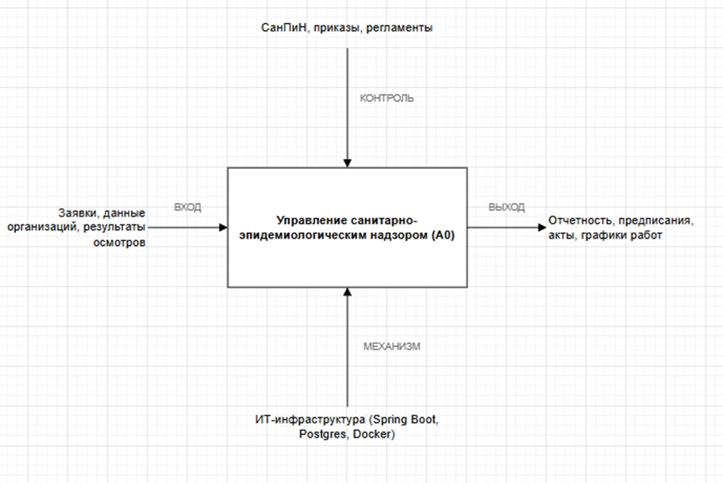
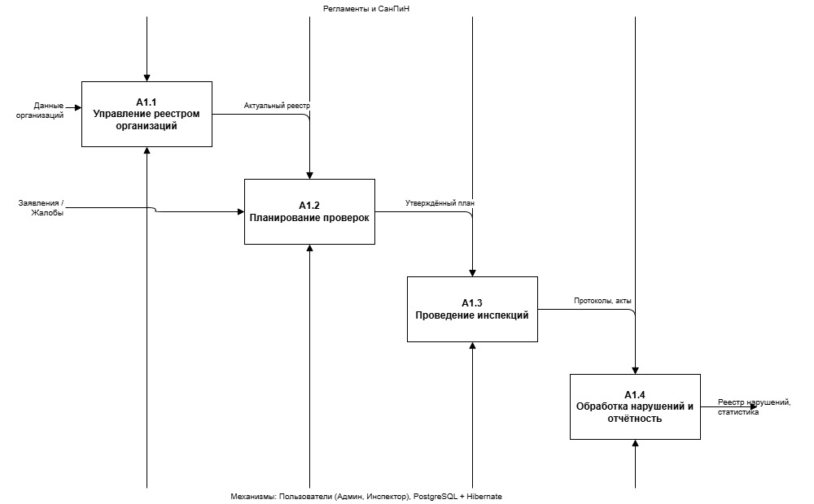
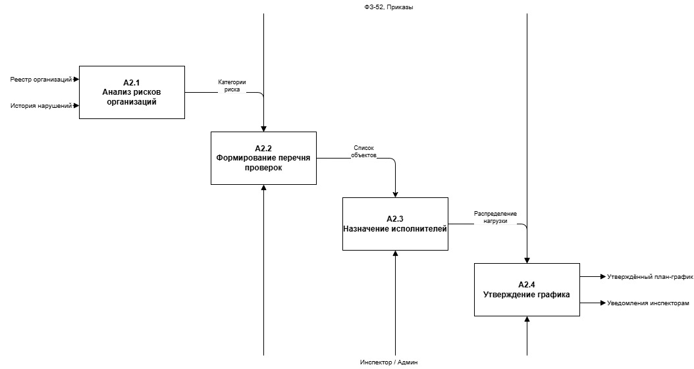
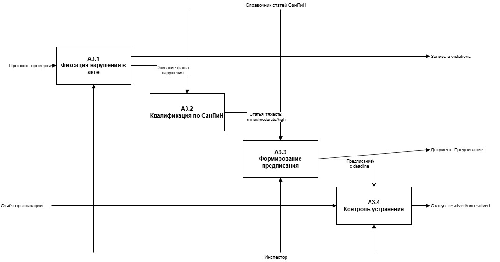
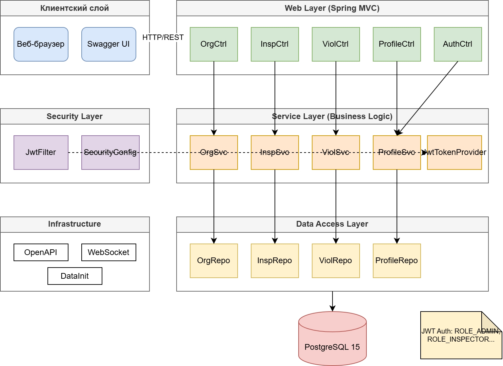

# ПАСПОРТ ПРОЕКТА

---

## 1. ОБЩАЯ ИНФОРМАЦИЯ

**Название проекта:** Информационная система ФБУЗ Центра гигиены и эпидемиологии  
**Траектория:** Веб-разработка (Fullstack Java/Spring)  
**Автор:** Зволибовская Екатерина Валерьевна  
**Дата начала:** 01.03.2026  
**Плановая дата завершения:** 01.06.2026  

---

## 2. БИЗНЕС-КОНТЕКСТ

Деятельность центров гигиены и эпидемиологии сопряжена с высокими объёмами рутинных операций: ведение реестров организаций, планирование выездных проверок, фиксация нарушений, контроль сроков устранения и формирование отчётности. В настоящее время эти процессы часто фрагментированы между бумажными журналами, электронными таблицами и разрозненными учётными системами, что приводит к потере данных, нарушению регламентных сроков и затрудняет аналитику.

Разрабатываемая информационная система призвана централизовать и автоматизировать ключевые бизнес-процессы санитарно-эпидемиологического надзора в соответствии с требованиями ФЗ-52 и актуальных СанПиН. Внедрение системы обеспечит переход от реактивного учёта к проактивному управлению проверками, повысит прозрачность взаимодействия с поднадзорными объектами и создаст единое информационное пространство для инспекторов, лаборантов и руководителей.

---

## 3. ЦЕЛИ ПРОЕКТА

**Главная цель:**  
Создание отказоустойчивой веб-платформы для автоматизации полного цикла санитарно-эпидемиологического надзора с обеспечением безопасности данных и экономической эффективности.

**Задачи:**
- Разработать единый цифровой реестр организаций с автоматическим расчётом категорий риска.
- Автоматизировать планирование, проведение и документирование проверок (акты, протоколы).
- Внедрить механизм учёта нарушений с контролем сроков устранения и системой уведомлений.
- Обеспечить ролевой доступ (ADMIN, INSPECTOR, LABORANT) и JWT-аутентификацию.
- Предоставить REST API и интерактивную документацию (OpenAPI/Swagger) для интеграций.
- Упаковать решение в Docker-контейнеры для быстрого развёртывания и масштабирования.

---

## 4. КЛЮЧЕВЫЕ ПОКАЗАТЕЛИ УСПЕХА (KPI)

| Категория | Показатель | Целевое значение |
|-----------|------------|------------------|
| **Экономика** | ROI (1-й год) | ≥ 14,7% |
| | Срок окупаемости | ≤ 10,5 месяцев |
| | Автоматизация рутины | 40% операций |
| **Качество** | Прохождение тестов | 100% (68 тестов) |
| | Покрытие кода (JaCoCo) | ≥ 41% (инструкции) |
| | Время отклика API (p95) | ≤ 1,8 сек |
| **Бизнес** | Точность контроля сроков | ≥ 99% |
| | Сокращение бумажного ДО | ≥ 85% |
| | Удовлетворённость пользователей | ≥ 4,5/5 |

---

## 5. КЛЮЧЕВЫЕ РИСКИ

| Риск | Вероятность | Воздействие | Стратегия реагирования |
|------|-------------|-------------|------------------------|
| **Изменение нормативной базы** (СанПиН, ФЗ-52) | Средняя | Высокое | Гибкая архитектура справочников, выделение правил в конфигурацию |
| **Сопротивление персонала / низкая цифровая грамотность** | Высокая | Среднее | Поэтапное внедрение, обучение, упрощённый UX, пилотная группа |
| **Киберугрозы и утечка ПДн** | Средняя | Высокое | JWT + ролевая модель, HTTPS, валидация входных данных, аудит логов, соответствие ФЗ-152 |
| **Недостаточное покрытие тестами ветвлений (12%)** | Высокая | Среднее | Приоритетное написание тестов для критических путей, code review, CI-пайплайн |
| **Зависимость от инфраструктуры / отключение электричества** | Низкая | Высокое | Docker-резервирование, автоматические бэкапы (pg_dump), план аварийного восстановления |

---

## 6. ТЕХНОЛОГИЧЕСКИЙ СТЕК

| Слой | Технологии |
|------|------------|
| **Backend** | Java 17+, Spring Boot 3.2.x, Spring Security, JWT, Lombok |
| **Frontend** | Thymeleaf, HTML5, CSS3, JavaScript (ES6+), адаптивная вёрстка |
| **Данные** | PostgreSQL 15, Spring Data JPA / Hibernate, Flyway/Liquibase (миграции) |
| **API & Docs** | REST, SpringDoc OpenAPI 2.4.0, Swagger UI |
| **Тестирование** | JUnit 5, Mockito, MockMvc, JaCoCo 0.8.12 |
| **DevOps** | Docker, Docker Compose, Gradle 8.x, Git, GitHub Actions (CI/CD) |
| **Мониторинг** | Spring Boot Actuator, Health Checks, логирование SLF4J/Logback |

---

## 7. МОДУЛЬНАЯ СТРУКТУРА

1. **Модуль аутентификации и авторизации**  
   Управление учётными записями, JWT-токены, ролевая модель (ADMIN/INSPECTOR/LABORANT), защита endpoints.

2. **Модуль реестра организаций**  
   CRUD-операции, классификация по типам, автоматический расчёт категорий риска, история взаимодействий.

3. **Модуль планирования и проведения проверок**  
   Формирование графиков, назначение исполнителей, фиксация статусов (planned/in_progress/completed), генерация актов.

4. **Модуль учёта нарушений**  
   Регистрация фактов, классификация по тяжести (minor/moderate/major/critical), установка сроков устранения, контроль исполнения.

5. **Модуль отчётности и аналитики**  
   Формирование стандартных актов и детальных протоколов, экспорт в PDF/Excel, статистика по организациям и инспекторам.

6. **Интеграционный модуль**  
   REST API для внешних систем, Swagger-документация, подготовка к подключению СМЭВ/Госуслуг, WebSocket-уведомления.

7. **Инфраструктурный модуль**  
   Контейнеризация (Docker), управление схемой БД, резервное копирование, мониторинг здоровья приложения, логирование.

---

# Анализ бизнес-процессов (IDEF0)

## Диаграмма A0. Контекстная диаграмма

Определяет систему как единый функциональный блок, устанавливая её границы и точки взаимодействия с внешней средой.
**Входом** служат заявки, данные поднадзорных организаций и результаты полевых осмотров.
**Выходом** являются формируемые отчёты, предписания, акты и графики работ.
Процесс **управляется** нормативной базой (СанПиН, приказы, регламенты) и **обеспечивается** развёрнутой ИТ-инфраструктурой (Spring Boot, PostgreSQL, Docker).

---

## Диаграмма A1. Декомпозиция процесса A0

Разбивает центральный процесс на четыре логически связанные подпроцесса, выстроенные в последовательный workflow: ведение реестра → планирование → проведение инспекций → обработка нарушений.
Показывает сквозные потоки данных: актуальный реестр передаётся в планирование, утверждённый план направляется на проведение проверок, а протоколы и акты поступают в модуль отчётности.
Все блоки регулируются едиными регламентами и обеспечиваются ролями пользователей (Админ, Проверяющий) и СУБД.

---

## Диаграмма A2: Детализация процесса «Планирование проверок»

Раскрывает алгоритм формирования графика инспекций.
Процесс начинается с **анализа рисков** на основе реестра организаций и истории прошлых нарушений, что позволяет присвоить категории приоритетности.
Далее формируется **перечень объектов**, распределяется нагрузка между сотрудниками и происходит **утверждение графика**.
Управление осуществляется требованиями ФЗ-52, исполнение возложено на инспекторов и администраторов. Результатом являются утверждённый план-график и автоматические уведомления исполнителям.

---

## Диаграмма A3. Детализация процесса «Обработка нарушений»

Описывает пост-инспекционный цикл работы с выявленными отклонениями.
Включает последовательные этапы: фиксация факта в протоколе → юридическая **квалификация** по справочнику статей СанПиН (с определением тяжести) → генерация **предписания** с указанием сроков устранения → **контроль исполнения** на основе отчётов организации.
Процесс замыкает цикл проверки, переводя запись в статус `resolved` (устранено) или фиксируя рецидив для повторного выезда.

---

# Business Use Case диаграмма

### Описание слоёв

**Клиентский слой**  
Веб-браузер и Swagger UI взаимодействуют с системой через HTTP/REST запросы.

**Web Layer (Spring MVC)**  
Контроллеры обрабатывают входящие запросы:
- `OrgCtrl` — управление организациями
- `InspCtrl` — управление проверками
- `ViolCtrl` — управление нарушениями
- `ProfileCtrl` — управление профилями пользователей
- `AuthCtrl` — аутентификация и авторизация

**Security Layer**  
`JwtFilter` и `SecurityConfig` обеспечивают защиту API через JWT-токены и конфигурацию безопасности Spring Security.

**Service Layer (Business Logic)**  
Сервисный слой содержит бизнес-логику:
- `OrgSvc`, `InspSvc`, `ViolSvc`, `ProfileSvc` — бизнес-операции с сущностями
- `JwtTokenProvider` — генерация и валидация JWT-токенов

**Data Access Layer**  
Репозитории (`OrgRepo`, `InspRepo`, `ViolRepo`, `ProfileRepo`) обеспечивают доступ к данным через Spring Data JPA.

**Infrastructure**  
Вспомогательные компоненты: OpenAPI (документация), WebSocket (real-time уведомления), DataInit (инициализация данных).

**Database**  
PostgreSQL 15 — реляционная СУБД для хранения данных.

### Авторизация
JWT-аутентификация с ролями: `ROLE_ADMIN`, `ROLE_INSPECTOR`

---

## Архитектура системы

Диаграмма ниже показывает многоуровневую архитектуру приложения:

### Уровни системы:

1. **Клиентский слой** — веб-браузер и Swagger UI для взаимодействия с системой через HTTP/REST API

2. **Web Layer (Spring MVC)** — контроллеры обрабатывают HTTP-запросы:
   - `OrgCtrl` — управление организациями
   - `InspCtrl` — управление проверками
   - `ViolCtrl` — управление нарушениями
   - `ProfileCtrl` — управление профилями пользователей
   - `AuthCtrl` — аутентификация и авторизация

3. **Security Layer** — фильтрация запросов и настройка безопасности:
   - `JwtFilter` — проверка JWT-токенов
   - `SecurityConfig` — конфигурация Spring Security

4. **Service Layer (Business Logic)** — бизнес-логика приложения:
   - Сервисы (`OrgSvc`, `InspSvc`, `ViolSvc`, `ProfileSvc`)
   - `JwtTokenProvider` — генерация и валидация токенов

5. **Data Access Layer** — репозитории для работы с данными:
   - `OrgRepo`, `InspRepo`, `ViolRepo`, `ProfileRepo`

6. **Infrastructure** — вспомогательные компоненты:
   - `OpenAPI` — документация API
   - `WebSocket` — real-time уведомления
   - `DataInit` — инициализация данных

7. **PostgreSQL 15** — реляционная база данных

### Поток данных:
Клиент → Контроллер → Сервис → Репозиторий → PostgreSQL
↓
Security (JWT + роли: ADMIN, INSPECTOR, LABORANT)
---

# SWOT-анализ текущего состояния

### Сильные стороны (Strengths)

| № | Фактор | Описание |
|---|--------|----------|
| **1** | **Единый реестр всех проверок** | Централизованное хранение данных о планируемых, текущих и завершённых проверках исключает потерю информации и дублирование записей |
| **2** | **Автоматическая маршрутизация** | Проверки со статусом «Удовлетворительно» автоматически архивируются, проблемные требуют описания нарушений лаборантами в отдельном окне |
| **3** | **Быстрое формирование отчётов** | Генерация двух типов документов: стандартного акта и детального протокола нарушений для почтовой рассылки в несколько кликов |
| **4** | **Прозрачная история взаимодействий** | Полная история проверок каждой организации упрощает планирование повторных выездов и выявление системных нарушений |
| **5** | **Современный технологический стек** | Java 17 + Spring Boot 3.2.x + PostgreSQL 15 обеспечивают производительность, безопасность и долгосрочную поддержку |
| **6** | **REST API и документация** | SpringDoc OpenAPI 2.4.0 автоматически генерирует интерактивную документацию (Swagger UI) для интеграций |
| **7** | **Docker-контейнеризация** | Упрощённое развёртывание и переносимость между средами разработки и эксплуатации |

### Слабые стороны (Weaknesses)

| № | Фактор | Описание |
|---|--------|----------|
| **1** | **Необходимость переобучения персонала** | Требуется обучение работе с новыми статусами проверок, формами ввода данных и веб-интерфейсом |
| **2** | **Зависимость от технической исправности** | Бизнес-процесс критически зависит от работоспособности системы и наличия электропитания/интернета |
| **3** | **Риск человеческой ошибки** | Ошибка при первичном выборе статуса проверки может неверно направить весь процесс (неправильная маршрутизация) |
| **4** | **Ограниченное покрытие тестами** | Покрытие ветвлений кода всего 12%, что создаёт риски регрессии при внесении изменений |
| **5** | **Отсутствие мобильного приложения** | Нет офлайн-режима для инспекторов, работающих в полевых условиях без стабильного интернета |
| **6** | **Монолитная архитектура** | Затрудняет горизонтальное масштабирование отдельных модулей при росте нагрузки |

### Возможности (Opportunities)

| № | Фактор | Описание |
|---|--------|----------|
| **1** | **Сокращение времени уведомления** | Уменьшение временного разрыва между выявлением нарушения и отправкой официального уведомления нарушителю с нескольких дней до нескольких минут |
| **2** | **Аналитика повторяющихся нарушений** | Повышение качества контроля за счёт выявления паттернов и системных нарушений у одних и тех же организаций |
| **3** | **Интеграция с государственными системами** | Подключение к СМЭВ, порталу Госуслуг и системам Роспотребнадзора для автоматического обмена данными |
| **4** | **Внедрение прогнозных моделей** | Использование ML для прогнозирования рисков нарушений на основе исторических данных |
| **5** | **Расширение функционала** | Добавление модуля лабораторных исследований с загрузкой результатов анализов в формате PDF |

### Угрозы (Threats)

| № | Фактор | Описание |
|---|--------|----------|
| **1** | **Изменение нормативной базы** | Корректировки СанПиН, ФЗ-52 или регламентов могут потребовать срочных доработок системы |
| **2** | **Киберугрозы и безопасность** | Рост атак на государственные информационные системы требует постоянного обновления механизмов защиты |
| **3** | **Конкуренция с готовыми решениями** | Рынок предлагает коробочные продукты (1С, Контур), которые могут быть быстрее внедрены |
| **4** | **Недостаточное финансирование** | Риск сокращения бюджета на поддержку и развитие системы после первоначального внедрения |
| **5** | **Сопротивление изменениям** | Консервативность персонала и нежелание переходить от бумажного документооборота к цифровому |

---

# Анализ аналогов и конкурентов

### Категории аналогов

К основным категориям аналогов можно отнести:

1. **Универсальные лабораторные информационные системы (ЛИС)**
   - Примеры: «Инвитро», «Bars.group»
   - Обладают мощным функционалом для лабораторной диагностики
   - **Недостаток**: технически нецелесообразны для задач учёта выездных проверок и регистрации актов

2. **Коробочные решения для госсектора**
   - Примеры: 1С:Медицина, Контур.Диадок
   - Быстрое внедрение, готовая отчётность
   - **Недостаток**: ограниченная гибкость доработок под специфику санитарного надзора

3. **Low-code BPM-платформы**
   - Примеры: ELMA BPM, Comindware
   - Гибкая настройка бизнес-процессов
   - **Недостаток**: избыточность для линейных процессов, высокая стоимость лицензий

4. **Самописные системы региональных центров**
   - Индивидуальная разработка под локальные требования
   - **Недостаток**: отсутствие поддержки, устаревшие технологии

### Детальный анализ конкурентов

| Решение | Тип | Преимущества | Недостатки | Применимость |
|---------|-----|-------------|------------|--------------|
| **Инвитро (ЛИС)** | Универсальная ЛИС | Мощный функционал лабораторной диагностики, автоматизация анализов, интеграция с оборудованием | Ориентирована на лабораторию, а не на выездные проверки; высокая стоимость; сложная кастомизация | **Низкая**: не предназначена для учёта проверок и регистрации актов |
| **Bars.group** | Универсальная ЛИС | Комплексная автоматизация лаборатории, электронный документооборот, отчётность | Отсутствие модуля планирования выездных проверок; избыточный функционал для задач надзора | **Низкая**: технически нецелесообразна для выездного контроля |
| **1С:Медицина** | Коробочное ПО | Готовая отчётность, интеграция с бухгалтерией 1С, поддержка франчайзи | Высокая стоимость лицензий, сложная кастомизация, устаревший интерфейс, ориентация на клиники | **Низкая**: избыточный функционал, не ориентирован на эпидемиологический надзор |
| **Контур.Диадок + модули** | Облачный сервис | Удобный интерфейс, быстрое внедрение, техподдержка, юридическая значимость документов | Закрытая архитектура, зависимость от облака, ограничения по доработкам, отсутствие специфики проверок | **Средняя**: подходит для документооборота, но не для специализированного учёта проверок |
| **ELMA BPM** | Low-code платформа | Гибкая настройка процессов, визуальный конструктор, интеграции, автоматизация workflow | Требует обучения, лицензирование по пользователям, сложность для простых задач, избыточность | **Низкая**: избыточна для линейных процессов санитарного надзора |
| **Самописные системы** | Индивидуальная разработка | Полное соответствие локальным требованиям, гибкость, низкая первоначальная стоимость | Отсутствие поддержки, устаревшие технологии (часто Access/Excel), риски безопасности, нет масштабирования | **Высокая как референс**, но требует полной модернизации под современные стандарты |

### Преимущества разрабатываемого решения

- **Централизация**: Единая платформа для всех процессов санитарно-эпидемиологического надзора
- **Автоматизация**: Алгоритмы расчёта категорий риска, уведомления о сроках, генерация актов по шаблонам
- **Открытость**: Использование стандартов REST API, OpenAPI, Docker обеспечивает лёгкую интеграцию
- **Экономическая эффективность**: Отсутствие лицензионных отчислений, возможность самостоятельной поддержки
- **Соответствие требованиям**: Архитектура спроектирована с учётом ФЗ-152 и приказов ФСТЭК

---

# Технические преимущества

### Преимущества выбранного стека

**Java 17 + Spring Boot 3.2.x**
- LTS-версия с долгосрочной поддержкой до 2029+ года
- Встроенные механизмы безопасности, валидации, кэширования
- Совместимость с облачными платформами и Kubernetes

**PostgreSQL 15**
- Поддержка сложных запросов, полнотекстового поиска, JSON, PostGIS
- Надёжная транзакционная модель (ACID) и репликация
- Открытая лицензия, отсутствие ограничений в госсекторе

**Docker + Docker Compose**
- Воспроизводимость сред (dev/test/prod)
- Упрощённое развёртывание: `docker compose up`
- Изоляция зависимостей и лёгкое обновление компонентов

**Spring Security + JWT**
- Гибкая настройка прав доступа (`@PreAuthorize`)
- Stateless-аутентификация для масштабирования
- Встроенная защита (CSRF, CORS, brute-force)

---

# Экономическое обоснование (ROI)

### Ежегодные операционные расходы (OPEX)

| Статья расходов | Описание | Сумма (₽/год) |
|----------------|----------|---------------|
| Инфраструктура | Аренда сервера, домен, SSL-сертификаты | 120 000 |
| Техническая поддержка | Мониторинг, исправление инцидентов, обновления | 180 000 |
| Резервное копирование | Хранение бэкапов, восстановление данных | 30 000 |
| Лицензии и сервисы | Мониторинг, логирование, внешние API | 30 000 |
| **Итого OPEX** | | **360 000** |

### Совокупные затраты

| Период | CAPEX (₽) | OPEX (₽) | Итого (₽) |
|--------|-----------|----------|-----------|
| **Год 1** | 1 100 000 | 360 000 | **1 460 000** |
| **Год 2+** | 0 | 360 000 | **360 000** |

---

### Источники экономического эффекта

| Источник эффекта | Механизм достижения | Годовой эффект (₽) |
|-----------------|-------------------|-------------------|
| **Экономия ФОТ** | Автоматизация 40% рутинных операций (ввод данных, формирование актов, рассылка уведомлений) | 1 125 000 |
| **Сокращение расходных материалов** | Отказ от бумажных журналов, снижение расходов на печать и почтовую пересылку | 150 000 |
| **Дополнительный доход** | Увеличение пропускной способности центра на 15% за счёт ускорения обработки заявок | 400 000 |
| **Итого годовой эффект** | | **1 675 000** |

### Финансовые показатели

#### Год 1 (с учётом инвестиций)

| Показатель | Формула | Расчёт | Значение |
|-----------|---------|--------|----------|
| Совокупные затраты | CAPEX + OPEX | 1 100 000 + 360 000 | 1 460 000 ₽ |
| Совокупный эффект | Σ источников | 1 125 000 + 150 000 + 400 000 | 1 675 000 ₽ |
| **Чистая прибыль** | Эффект − Затраты | 1 675 000 − 1 460 000 | **215 000 ₽** |
| **ROI** | (Прибыль / Затраты) × 100% | (215 000 / 1 460 000) × 100% | **14,7%** |
| **Срок окупаемости** | Затраты / (Эффект / 12 мес.) | 1 460 000 / (1 675 000 / 12) | **~10,5 месяцев** |

#### Год 2 (без учёта инвестиций)

| Показатель | Формула | Расчёт | Значение |
|-----------|---------|--------|----------|
| Совокупные затраты | OPEX | 360 000 | 360 000 ₽ |
| Совокупный эффект | Σ источников | 1 675 000 | 1 675 000 ₽ |
| **Чистая прибыль** | Эффект − Затраты | 1 675 000 − 360 000 | **1 315 000 ₽** |
| **ROI** | (Прибыль / Затраты) × 100% | (1 315 000 / 360 000) × 100% | **365%** |

---

### Вывод по экономическому обоснованию

#### Ключевые показатели эффективности

 **Проект является инвестиционно привлекательным**:  
- Положительная чистая прибыль уже в первый год (215 000 ₽)
- Рентабельность инвестиций (ROI) 14,7% превышает альтернативную стоимость капитала
- Срок окупаемости 10,5 месяцев укладывается в горизонт планирования

 **Высокий потенциал масштабирования**:  
- Во второй год эксплуатации чистая прибыль возрастает до 1 315 000 ₽
- ROI второго года составляет 365% благодаря отсутствию повторных инвестиций в разработку
- Архитектура системы позволяет подключать новые модули без пропорционального роста затрат

 **Устойчивость к рискам**:  
- Анализ чувствительности показывает, что даже при снижении эффекта на 20% проект сохраняет экономическую целесообразность
- Основные источники экономии (ФОТ, материалы) имеют гарантированный характер
- Дополнительный доход от увеличения пропускной способности является потенциальным бонусом

---