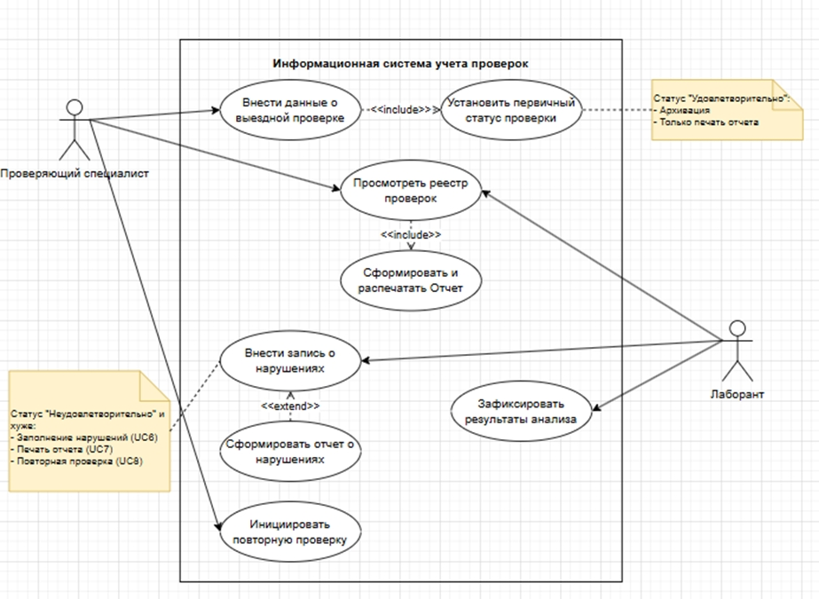
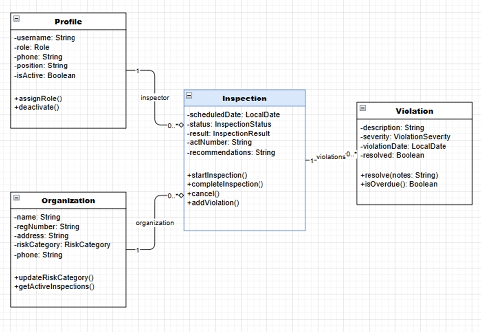

# Use Case диаграмма

## Участники диаграммы

### Проверяющий специалист
Основной пользователь системы, осуществляющий:
- Внесение данных о выездных проверках
- Просмотр реестра проверок
- Инициирование повторных проверок
- Работу с отчётной документацией

**Роль:** Инспектор/аудитор, проводящий санитарно-эпидемиологические проверки

---

### Лаборант
Специализированный пользователь, отвечающий за:
- Внесение записей о выявленных нарушениях
- Фиксацию результатов лабораторных анализов
- Просмотр реестра проверок
- Формирование отчётности

**Роль:** Технический специалист, документирующий нарушения и результаты исследований

---

## Назначение диаграммы

Диаграмма вариантов использования описывает **функциональные требования** к информационной системе учёта проверок и определяет:

### Основные цели:

1. **Автоматизация процесса проверок**
   - От внесения первичных данных до формирования итоговых отчётов
   - Маршрутизация документов в зависимости от статуса проверки

2. **Разграничение ответственности**
   - Чёткое разделение функций между проверяющим специалистом и лаборантом
   - Определение прав доступа к различным операциям системы

3. **Документирование и отчётность**
   - Централизованное хранение реестра проверок
   - Генерация стандартных отчётов и отчётов о нарушениях
   - Печать документов для архивации и рассылки

### Сценарии использования:

**Позитивный сценарий (статус "Удовлетворительно"):**
Внесение данных → Установка статуса → Архивация → Печать отчёта

**Негативный сценарий (статус "Неудовлетворительно"):**
Внесение данных → Фиксация нарушений → Формирование отчёта → Повторная проверка

---

# Domain Model (диаграмма классов)

## Описание

Диаграмма представляет **основные сущности системы** санитарно-эпидемиологического надзора и связи между ними.
Модель обеспечивает хранение данных о пользователях, проверяемых организациях, проводимых инспекциях и выявленных нарушениях.

## Классы

### Profile (Профиль пользователя)
Учётная запись сотрудника центра с ролевой моделью.

**Атрибуты:**
- `username: String` — имя пользователя
- `role: Role` — роль (ADMIN/INSPECTOR/LABORANT)
- `phone: String` — контактный телефон
- `position: String` — должность
- `isActive: Boolean` — статус активности

**Методы:**
- `assignRole()` — назначение роли
- `deactivate()` — деактивация профиля

---

### Organization (Организация)
Поднадзорный объект (предприятие, учреждение).

**Атрибуты:**
- `name: String` — наименование
- `regNumber: String` — регистрационный номер
- `address: String` — юридический адрес
- `riskCategory: RiskCategory` — категория риска
- `phone: String` — контактный телефон

**Методы:**
- `updateRiskCategory()` — пересчёт категории риска
- `getActiveInspections()` — получение активных проверок

---

### Inspection (Проверка)
Запись о проведённой или планируемой проверке.

**Атрибуты:**
- `scheduledDate: LocalDate` — плановая дата
- `status: InspectionStatus` — статус (PLANNED/IN_PROGRESS/COMPLETED)
- `result: InspectionResult` — результат
- `actNumber: String` — номер акта
- `recommendations: String` — рекомендации

**Методы:**
- `startInspection()` — начало проверки
- `completeInspection()` — завершение проверки
- `cancel()` — отмена проверки
- `addViolation()` — добавление нарушения

---

### Violation (Нарушение)
Зафиксированное нарушение санитарных норм.

**Атрибуты:**
- `description: String` — описание
- `severity: ViolationSeverity` — степень тяжести
- `violationDate: LocalDate` — дата выявления
- `resolved: Boolean` — статус устранения

**Методы:**
- `resolve(notes: String)` — отметка об устранении
- `isOverdue(): Boolean` — проверка просрочки

---

## Связи между классами

| Связь | Кардинальность | Описание |
|-------|----------------|----------|
| **Profile → Inspection** | 1 : 0..* | Один инспектор проводит множество проверок (роль: `inspector`) |
| **Organization → Inspection** | 1 : 0..* | Одна организация проходит множество проверок (роль: `organization`) |
| **Inspection → Violation** | 1 : 0..* | Одна проверка может содержать множество нарушений (роль: `violations`) |

---