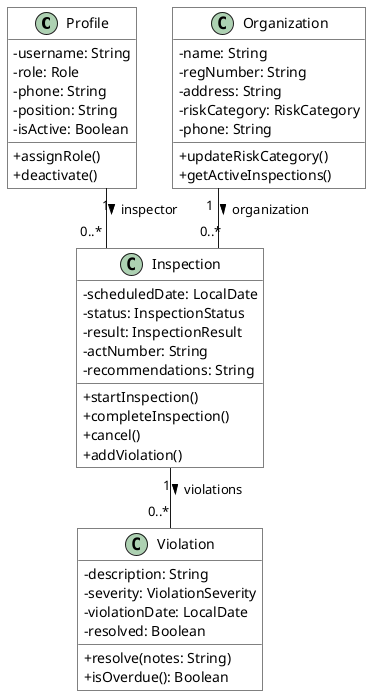

```plantuml
@startuml

skinparam classAttributeIconSize 0
skinparam shadowing false
skinparam roundcorner 0
skinparam linetype ortho

class Profile {
    -username: String
    -role: Role
    -phone: String
    -position: String
    -isActive: Boolean
    +assignRole()
    +deactivate()
}

class Organization {
    -name: String
    -regNumber: String
    -address: String
    -riskCategory: RiskCategory
    -phone: String
    +updateRiskCategory()
    +getActiveInspections()
}

class Inspection {
    -scheduledDate: LocalDate
    -status: InspectionStatus
    -result: InspectionResult
    -actNumber: String
    -recommendations: String
    +startInspection()
    +completeInspection()
    +cancel()
    +addViolation()
}

class Violation {
    -description: String
    -severity: ViolationSeverity
    -violationDate: LocalDate
    -resolved: Boolean
    +resolve(notes: String)
    +isOverdue(): Boolean
}

' Связи с точной кардинальностью
Profile "1" -- "0..*" Inspection : inspector >
Organization "1" -- "0..*" Inspection : organization >
Inspection "1" -- "0..*" Violation : violations >

' Стилизация
skinparam class {
    BackgroundColor White
    BorderColor Black
    AttributeFontName Helvetica
    MethodFontName Helvetica
    AttributesFontSize 10
    MethodsFontSize 10
}

' Выделение Inspection голубым цветом
skinparam rectangle<<Inspection>> {
    BackgroundColor #D4E6F1
    BorderColor Black
}

@enduml
```