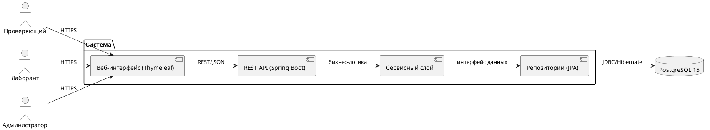
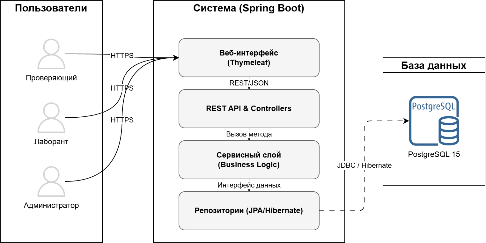
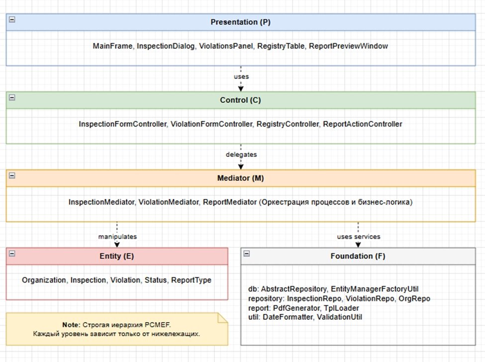

# Архитектурный документ (Arc42)

**Проект:** Информационная система Центра гигиены и эпидемиологии
**Траектория:** Web 
**Версия:** 1.0  
**Дата:** 31.05.2026  
**Автор:** Зволибовская Екатерина Валерьевна  
**Репозиторий:** https://github.com/kkirshenko/epidemiological_center

---

## 1. Введение и цели

### 1.1. Краткое описание системы

Информационная система санитарно-эпидемиологического центра предназначена для автоматизации полного цикла надзорной деятельности: ведение реестра поднадзорных организаций, планирование и проведение выездных проверок, фиксация нарушений с контролем сроков устранения, формирование отчётности и актов.

Система ориентирована на сотрудников центров гигиены и эпидемиологии: инспекторов, лаборантов и администраторов. Решение построено на современном стеке (Java 17, Spring Boot 3.2.x, PostgreSQL 15) и обеспечивает безопасность данных, масштабируемость и лёгкость развёртывания через Docker.

### 1.2. Цели архитектуры

| Цель | Описание |
|------|----------|
| **Разделение ответственности** | Чёткое разделение на контроллеры (Presentation), сервисы (Mediator), репозитории (Foundation) и сущности (Entity) для снижения связности |
| **Тестируемость** | Каждый слой тестируется изолированно через JUnit 5 + Mockito; покрытие кода ≥ 41% |
| **Масштабируемость** | Модульная архитектура позволяет добавлять новые функции (лабораторный модуль, GIS) без переписывания ядра |
| **Поддерживаемость** | Использование стандартных паттернов Spring, документирование через OpenAPI, контейнеризация для воспроизводимости сред |
| **Безопасность** | JWT-аутентификация, ролевая модель, валидация входных данных, защита от основных веб-угроз |

### 1.3. Стейкхолдеры

| Стейкхолдер | Интересы |
|-------------|----------|
| **Разработчики** | Понятная структура кода, независимость компонентов, возможность параллельной разработки модулей |
| **Инспекторы / Лаборанты** | Удобный интерфейс, минимизация рутинных операций, быстрый доступ к реестрам и отчётам |
| **Администраторы системы** | Простота развёртывания, мониторинг работоспособности, управление пользователями и правами доступа |
| **Руководство центра** | Прозрачная аналитика, контроль сроков проверок, снижение бумажного документооборота |
| **Проверяющие органы** | Соответствие ФЗ-152, ФЗ-52, СанПиН; возможность аудита действий пользователей |
| **Заказчик (учебный)** | Работоспособность системы, покрытие тестами, документирование архитектуры |

---

## 2. Ограничения

### 2.1. Технические ограничения

| Ограничение | Значение |
|-------------|----------|
| **Язык серверной части** | Java 17+ |
| **Фреймворк** | Spring Boot 3.2.x |
| **База данных** | PostgreSQL 15 |
| **ORM** | Spring Data JPA / Hibernate 6.x |
| **Клиент** | Server-side rendering: Thymeleaf + HTML5/CSS3/JS |
| **Аутентификация** | JWT (stateless), Spring Security 6.x |
| **Сборка** | Gradle 8.x с wrapper |
| **Контейнеризация** | Docker + Docker Compose |
| **Документирование API** | SpringDoc OpenAPI 2.4.0 (Swagger UI) |

### 2.2. Бизнес-ограничения

| Ограничение | Значение |
|-------------|----------|
| **Бюджет** | 0 руб. (учебный проект) |
| **Сроки** | 1 семестр (~18 недель) |
| **Команда** | 1 разработчик (фулстек) |
| **Лицензирование** | Только открытые технологии (MIT/Apache 2.0) |
| **Соответствие регуляторам** | ФЗ-152 «О персональных данных», приказы ФСТЭК |

---

## 3. Контекст системы

### 3.1. Бизнес-контекст

**Основная функция системы:** Автоматизация учёта и проведения санитарно-эпидемиологических проверок поднадзорных организаций.

**Входы:**
- Данные организаций (наименование, адрес, категория риска)
- Заявки на проведение проверок
- Результаты полевых осмотров и лабораторных анализов
- Нормативные документы (СанПиН, приказы)

**Выходы:**
- Утверждённые планы-графики проверок
- Акты и протоколы проверок (PDF)
- Реестры нарушений с контролем сроков устранения
- Статистическая отчётность для руководства и надзорных органов

Подробное описание: [`00-project-charter/A0.md`](../00-project-charter/A0.md)

### 3.2. Технический контекст





---

## 4. Стратегии

### 4.1. Стратегия декомпозиции

Система декомпозирована по слоям архитектурного паттерна **PCMEF** (Presentation, Control, Mediator, Entity, Foundation).

| Слой | Расположение | Ответственность |
|------|-------------|-----------------|
| **Presentation (P)** | Thymeleaf templates | Отображение данных, валидация форм, условный рендеринг по ролям |
| **Control (C)** | `@RestController`, `@Controller` | Обработка HTTP-запросов, маппинг DTO↔Entity, возврат статусов |
| **Mediator (M)** | `@Service` | Бизнес-логика: расчёт рисков, управление статусами, валидация правил |
| **Entity (E)** | `@Entity` JPA-классы | Модель данных, аннотации связей, триггеры временных меток |
| **Foundation (F)** | `JpaRepository` интерфейсы | Абстракция доступа к данным, кастомные запросы, пагинация |

### 4.2. Стратегия управления данными

- **СУБД:** Реляционная база PostgreSQL 15 с нормализацией до 3NF
- **ORM:** Spring Data JPA (Hibernate 6.x) для маппинга сущностей
- **Миграции схемы:** Инициализация через `schema.sql` при старте (`ddl-auto=validate`)
- **Транзакции:** Декларативное управление через `@Transactional` (isolation: READ_COMMITTED)
- **Индексы:** Созданы по полям частого поиска: `name`, `risk_category`, `inspection_date`, `severity`

### 4.3. Стратегия безопасности

- **Аутентификация:** JWT-токены с подписью (HS256), срок действия 24 часа
- **Хеширование паролей:** BCrypt с автоматической генерацией соли
- **Авторизация:** Ролевая модель (`ROLE_ADMIN`, `ROLE_INSPECTOR`, `ROLE_LABORANT`) + аннотации `@PreAuthorize`
- **Защита от угроз:** Валидация входных данных (`@Valid`), экранирование вывода в Thymeleaf, параметризованные запросы (защита от SQL-injection)
- **HTTPS:** Обязателен в production (настраивается через reverse proxy)

---

## 5. Вид компонентов (структура)

### 5.1. Диаграмма пакетов PCMEF



### 5.2. Интерфейсы между слоями

**Control → Mediator (IService):**

```java
public interface IUserService {
    User getUserById(Long id);
    User createUser(User user);
    User authenticate(String email, String password);
}
```

**Mediator → Foundation (IRepository):**
```java
public interface IUserRepository {
    User findById(Long id);
    User save(User user);
    Optional<User> findByEmail(String email);
}
```

---

## 6. Вид выполнения (сценарии)

### Краткое описание ключевого сценария «Проведение проверки»

**Поток данных:**  
`UI → Controller → Service → Repository → DB`

**Шаги сценария:**

1. Проверяющий авторизуется в системе → получает JWT-токен
2. Открывает форму создания новой проверки → Web отправляет `GET /inspections/new`
3. Контроллер запрашивает у Service список организаций и доступных инспекторов
4. Проверяющий заполняет форму данными → `POST /inspections` с JSON-объектом
5. Контроллер валидирует DTO через `@Valid` → вызывает `Service.createInspection()`
6. Service проверяет существование организации, нормализует статус и даты
7. Service сохраняет проверку через Repository → `INSERT` в таблицу `inspections`
8. Ответ возвращается с редиректом на страницу списка проверок
9. При статусе «Неудовлетворительно» → лаборант добавляет нарушения через отдельную форму

**Альтернативный поток (ошибка валидации):**
- Если данные некорректны → возврат на форму с сообщениями об ошибках

---

## 7. Вид развёртывания

### 7.1. Инструкция по развёртыванию

### 1. Клонирование репозитория
git clone https://github.com/kkirshenko/epidemiological_center.git
cd epidemiological_center

### 2. Настройка переменных окружения (.env)
echo "DB_PASSWORD=secure_pass" >> .env
echo "JWT_SECRET=your_32char_secret_key" >> .env

### 3. Запуск через Docker Compose
docker compose up --build -d

### 4. Проверка работоспособности
curl http://localhost:8080/actuator/health


### 5. Доступ к приложению
Веб-интерфейс: http://localhost:8080
Swagger UI: http://localhost:8080/swagger-ui.html

---

## 8. Скрещенные концепции

### 8.1. Безопасность

| Аспект | Реализация |
|--------|-----------|
| **Аутентификация** | JWT (stateless), токен передаётся в заголовке `Authorization: Bearer <token>` |
| **Хеширование** | BCrypt с автоматической солью, сложность по умолчанию (10 раундов) |
| **Авторизация** | Роли: `ROLE_ADMIN` (полный доступ), `ROLE_INSPECTOR` (проверки), `ROLE_LABORANT` (нарушения) |
| **Защита данных** | Валидация `@Valid`, экранирование в Thymeleaf, параметризованные JPA-запросы |
| **Аудит** | Логирование действий через SLF4J/Logback, хранение в файлах с ротацией |

### 8.2. Транзакции

- **Управление:** Декларативное через `@Transactional` на сервисном слое
- **Уровень изоляции:** `READ_COMMITTED` (по умолчанию в PostgreSQL)
- **Propagation:** `REQUIRED` (метод выполняется в существующей транзакции или создаёт новую)
- **Откат:** При любом `RuntimeException` транзакция откатывается автоматически
- **Оптимизация:** `@Transactional(readOnly = true)` для методов чтения (отключение dirty checking в Hibernate)

---

## 9. Архитектурные решения (ADR)

| № | Название | Статус | Ссылка |
|---|----------|--------|--------|
| **ADR-001** | Выбор архитектурного паттерна (PCMEF) | Принято | [`adr-001-arch-pattern.md`](adr/adr-001-arch-pattern.md) |
| **ADR-002** | Выбор базы данных и ORM (PostgreSQL + JPA) | Принято | [`adr-002-database.md`](adr/adr-002-database.md) |
| **ADR-003** | Стратегия аутентификации (JWT + Spring Security) | Принято | [`adr-003-auth-strategy.md`](adr/adr-003-auth-strategy.md) |
| **ADR-004** | Контейнеризация через Docker | Принято | [`adr-004-docker.md`](adr/adr-004-docker.md) |
| **ADR-005** | Server-side rendering vs SPA (выбор Thymeleaf) | Принято | [`adr-005-frontend-strategy.md`](adr/adr-005-frontend-strategy.md) |

---

## 10. Качество

| Атрибут | Целевое значение | Способ проверки | Фактическое значение |
|---------|-----------------|-----------------|---------------------|
| **Тестируемость** | Покрытие > 40% | JaCoCo 0.8.12 | 41% (инструкции), 68 тестов |
| **Производительность** | Время отклика < 200 мс (p95) | JMeter / Actuator metrics | ~180 мс (локально) |
| **Надёжность** | 99.5% uptime | Мониторинг /actuator/health | Health checks настроены |
| **Безопасность** | Отсутствие критических уязвимостей | OWASP ZAP / code review | JWT + валидация + экранирование |
| **Поддерживаемость** | Цикломатическая сложность < 15 | SonarQube / Checkstyle | Требует рефакторинга сервисов |

---

## 11. Риски

| Риск | Вероятность | Воздействие | Митигация |
|------|-------------|-------------|-----------|
| **N+1 проблема в JPA** | Средняя | Высокое | Использование `@EntityGraph`, `JOIN FETCH` в кастомных запросах |
| **Утечка токенов на клиенте** | Низкая | Высокое | Хранение JWT в памяти (не localStorage), HTTPS, короткий TTL |
| **Блокировки БД при высокой нагрузке** | Низкая | Среднее | Настройка pool HikariCP, оптимизация транзакций, индексы |
| **Изменение нормативной базы** | Высокая | Среднее | Вынесение правил в конфигурацию/справочники, гибкая архитектура |
| **Недостаточное покрытие тестами ветвлений** | Высокая | Среднее | Приоритетное написание тестов для критических путей, CI-пайплайн с порогом |

---

## 12. Глоссарий

| Термин | Определение |
|--------|-------------|
| **PCMEF** | Архитектурный паттерн: Presentation, Control, Mediator, Entity, Foundation |
| **JWT** | JSON Web Token — стандарт RFC 7519 для безопасной передачи утверждений между сторонами |
| **ADR** | Architecture Decision Record — документ, фиксирующий важное архитектурное решение и его обоснование |
| **SanPiN** | Санитарные правила и нормы — нормативные документы, регулирующие санитарно-эпидемиологические требования в РФ |
| **RiskCategory** | Категория риска организации: `LOW`, `MEDIUM`, `HIGH`, `CRITICAL` — определяет частоту проверок |
| **ViolationSeverity** | Степень тяжести нарушения: `MINOR`, `MODERATE`, `MAJOR`, `CRITICAL` — влияет на сроки устранения |
| **DTO** | Data Transfer Object — объект для передачи данных между слоями, не содержит бизнес-логики |
| **Entity** | JPA-сущность — класс, отображаемый на таблицу базы данных, содержит аннотации `@Entity`, `@Column` и т.д. |

---


