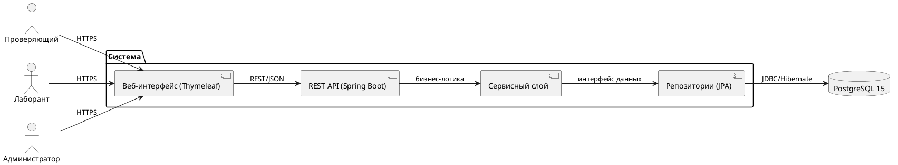

```plantuml
@startuml
left to right direction

actor "Проверяющий" as Inspector
actor "Лаборант" as Laborant
actor "Администратор" as Admin

package "Система" {
    [Веб-интерфейс (Thymeleaf)] as Web
    [REST API (Spring Boot)] as API
    [Сервисный слой] as Service
    [Репозитории (JPA)] as Repo
}

database "PostgreSQL 15" as DB

Inspector --> Web : HTTPS
Laborant --> Web : HTTPS
Admin --> Web : HTTPS

Web --> API : REST/JSON
API --> Service : бизнес-логика
Service --> Repo : интерфейс данных
Repo --> DB : JDBC/Hibernate

@enduml
```