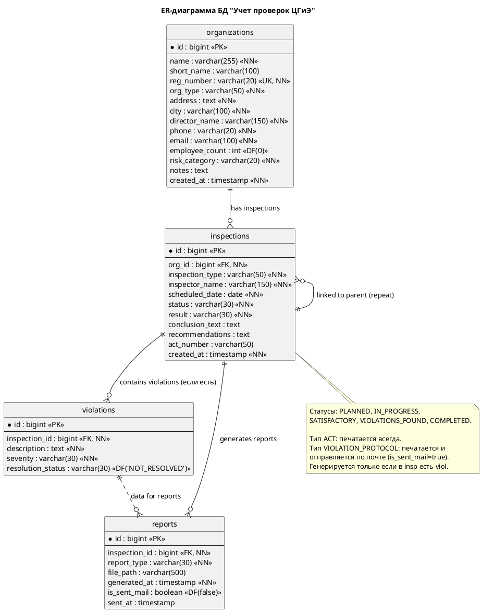

```plantuml
@startuml
title ER-диаграмма БД "Учет проверок ЦГиЭ"

skinparam entity {
  BackgroundColor White
  BorderColor Black
  ArrowColor Black
}
skinparam relationship {
  Color Black
  LineThickness 1
}

hide circle

' Сущности
entity "organizations" as org {
  *id : bigint <<PK>>
  --
  name : varchar(255) <<NN>>
  short_name : varchar(100)
  reg_number : varchar(20) <<UK, NN>>
  org_type : varchar(50) <<NN>>
  address : text <<NN>>
  city : varchar(100) <<NN>>
  director_name : varchar(150) <<NN>>
  phone : varchar(20) <<NN>>
  email : varchar(100) <<NN>>
  employee_count : int <<DF(0)>>
  risk_category : varchar(20) <<NN>>
  notes : text
  created_at : timestamp <<NN>>
}

entity "inspections" as insp {
  *id : bigint <<PK>>
  --
  org_id : bigint <<FK, NN>>
  inspection_type : varchar(50) <<NN>>
  inspector_name : varchar(150) <<NN>>
  scheduled_date : date <<NN>>
  status : varchar(30) <<NN>>
  result : varchar(30) <<NN>>
  conclusion_text : text
  recommendations : text
  act_number : varchar(50)
  created_at : timestamp <<NN>>
}

entity "violations" as viol {
  *id : bigint <<PK>>
  --
  inspection_id : bigint <<FK, NN>>
  description : text <<NN>>
  severity : varchar(30) <<NN>>
  resolution_status : varchar(30) <<DF('NOT_RESOLVED')>>
}

entity "reports" as rep {
  *id : bigint <<PK>>
  --
  inspection_id : bigint <<FK, NN>>
  report_type : varchar(30) <<NN>>
  file_path : varchar(500)
  generated_at : timestamp <<NN>>
  is_sent_mail : boolean <<DF(false)>>
  sent_at : timestamp
}

' Отношения
org ||--o{ insp : "has inspections"
insp ||--o{ viol : "contains violations (если есть)"
insp ||--o{ rep : "generates reports"
insp }o--|| insp : "linked to parent (repeat)"
viol ||..o{ rep : "data for reports"

note bottom of insp
  Статусы: PLANNED, IN_PROGRESS,
  SATISFACTORY, VIOLATIONS_FOUND, COMPLETED.

  Тип ACT: печатается всегда.
  Тип VIOLATION_PROTOCOL: печатается и 
  отправляется по почте (is_sent_mail=true).
  Генерируется только если в insp есть viol.
end note
@enduml
```
