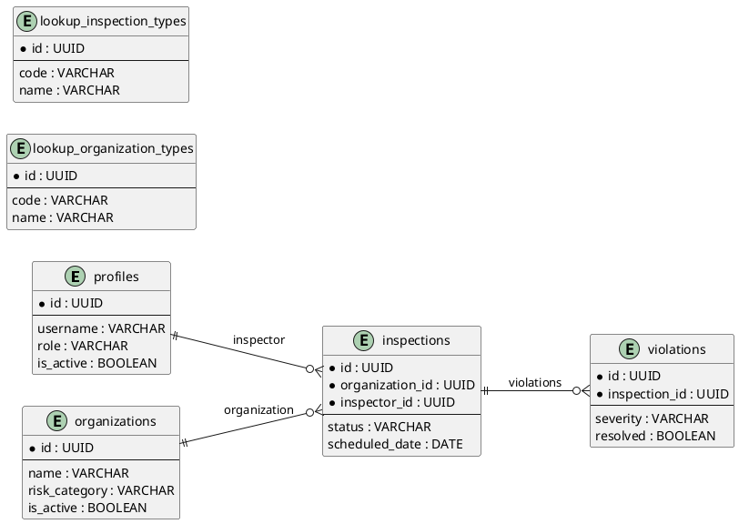

# DDL базы данных

**Проект:** Информационная система Центра гигиены и эпидемиологии 
**СУБД:** PostgreSQL 15  
**Схема:** sanepidcenter  
**Дата актуализации:** 01.06.2026

---

## Описание таблиц

### 1. profiles (Профили пользователей)

**Назначение:** Хранение учётных записей сотрудников центра с ролевой моделью.

| Колонка | Тип данных | Ограничения | Описание |
|---------|------------|-------------|----------|
| `id` | UUID | PRIMARY KEY, NOT NULL | Уникальный идентификатор профиля |
| `username` | VARCHAR(50) | UNIQUE, NOT NULL | Имя пользователя для входа |
| `password_hash` | VARCHAR(255) | NOT NULL | Хеш пароля (BCrypt) |
| `full_name` | VARCHAR(100) | NOT NULL | ФИО сотрудника |
| `role` | VARCHAR(20) | NOT NULL | Роль: ADMIN, INSPECTOR, LABORANT |
| `position` | VARCHAR(100) | NULL | Должность |
| `phone` | VARCHAR(20) | NULL | Контактный телефон |
| `is_active` | BOOLEAN | DEFAULT TRUE | Флаг активности учётной записи |
| `created_at` | TIMESTAMP | DEFAULT NOW() | Дата создания записи |
| `updated_at` | TIMESTAMP | DEFAULT NOW() | Дата последнего обновления |

**Индексы:**
- `idx_profiles_username` — по полю `username` для быстрой аутентификации
- `idx_profiles_role` — по полю `role` для фильтрации по ролям
- `idx_profiles_is_active` — по полю `is_active` для поиска активных пользователей

---

### 2. organizations (Организации)

**Назначение:** Реестр поднадзорных организаций (предприятия, учреждения).

| Колонка | Тип данных | Ограничения | Описание |
|---------|------------|-------------|----------|
| `id` | UUID | PRIMARY KEY, NOT NULL | Уникальный идентификатор организации |
| `name` | VARCHAR(200) | NOT NULL | Полное наименование организации |
| `short_name` | VARCHAR(100) | NULL | Краткое наименование |
| `registration_number` | VARCHAR(50) | UNIQUE, NOT NULL | Регистрационный номер (ИНН/ОГРН) |
| `organization_type` | VARCHAR(50) | NOT NULL | Тип: FOOD_SERVICE, MEDICAL, EDUCATIONAL и др. |
| `address` | VARCHAR(300) | NOT NULL | Юридический адрес |
| `city` | VARCHAR(100) | NOT NULL | Город |
| `director_name` | VARCHAR(100) | NULL | ФИО руководителя |
| `phone` | VARCHAR(20) | NULL | Контактный телефон |
| `email` | VARCHAR(100) | NULL | Email |
| `employee_count` | INTEGER | NULL | Количество сотрудников |
| `risk_category` | VARCHAR(20) | DEFAULT 'LOW' | Категория риска: LOW, MEDIUM, HIGH, CRITICAL |
| `is_active` | BOOLEAN | DEFAULT TRUE | Флаг активности (мягкое удаление) |
| `created_at` | TIMESTAMP | DEFAULT NOW() | Дата внесения в реестр |
| `updated_at` | TIMESTAMP | DEFAULT NOW() | Дата последнего обновления |

**Индексы:**
- `idx_org_name` — по полю `name` для поиска организаций
- `idx_org_risk_category` — по полю `risk_category` для фильтрации по риску
- `idx_org_city` — по полю `city` для группировки по городам
- `idx_org_is_active` — по полю `is_active` для активных записей

---

### 3. inspections (Проверки)

**Назначение:** Журнал проведённых и планируемых проверок организаций.

| Колонка | Тип данных | Ограничения | Описание |
|---------|------------|-------------|----------|
| `id` | UUID | PRIMARY KEY, NOT NULL | Уникальный идентификатор проверки |
| `organization_id` | UUID | FOREIGN KEY, NOT NULL | Ссылка на организацию |
| `inspector_id` | UUID | FOREIGN KEY, NOT NULL | Ссылка на инспектора (profile) |
| `inspection_type` | VARCHAR(30) | NOT NULL | Тип: PLANNED, UNSCHEDULED, REPEATED |
| `scheduled_date` | DATE | NOT NULL | Плановая дата проверки |
| `start_date` | DATE | NULL | Фактическая дата начала |
| `end_date` | DATE | NULL | Фактическая дата завершения |
| `status` | VARCHAR(20) | DEFAULT 'PLANNED' | Статус: PLANNED, IN_PROGRESS, COMPLETED, CANCELLED |
| `result` | VARCHAR(20) | NULL | Результат: SATISFACTORY, UNSATISFACTORY, CRITICAL |
| `findings_summary` | TEXT | NULL | Краткое содержание выводов |
| `recommendations` | TEXT | NULL | Рекомендации по устранению нарушений |
| `act_number` | VARCHAR(50) | UNIQUE, NULL | Номер акта проверки |
| `created_at` | TIMESTAMP | DEFAULT NOW() | Дата создания записи |
| `updated_at` | TIMESTAMP | DEFAULT NOW() | Дата последнего обновления |

**Индексы:**
- `idx_insp_organization_id` — по полю `organization_id` для поиска проверок организации
- `idx_insp_inspector_id` — по полю `inspector_id` для поиска проверок инспектора
- `idx_insp_status` — по полю `status` для фильтрации по статусу
- `idx_insp_scheduled_date` — по полю `scheduled_date` для планирования
- `idx_insp_result` — по полю `result` для статистики

---

### 4. violations (Нарушения)

**Назначение:** Учёт выявленных нарушений санитарных норм в рамках проверок.

| Колонка | Тип данных | Ограничения | Описание |
|---------|------------|-------------|----------|
| `id` | UUID | PRIMARY KEY, NOT NULL | Уникальный идентификатор нарушения |
| `inspection_id` | UUID | FOREIGN KEY, NOT NULL | Ссылка на проверку |
| `code` | VARCHAR(20) | NULL | Код нарушения (по СанПиН) |
| `description` | TEXT | NOT NULL | Описание нарушения |
| `severity` | VARCHAR(20) | NOT NULL | Степень тяжести: MINOR, MODERATE, MAJOR, CRITICAL |
| `article_reference` | VARCHAR(100) | NULL | Ссылка на статью нормативного документа |
| `violation_date` | DATE | NOT NULL | Дата выявления нарушения |
| `correction_deadline` | DATE | NOT NULL | Срок устранения нарушения |
| `resolved` | BOOLEAN | DEFAULT FALSE | Флаг устранения нарушения |
| `resolution_notes` | TEXT | NULL | Примечания об устранении |
| `resolved_at` | TIMESTAMP | NULL | Дата фактического устранения |
| `created_at` | TIMESTAMP | DEFAULT NOW() | Дата создания записи |
| `updated_at` | TIMESTAMP | DEFAULT NOW() | Дата последнего обновления |

**Индексы:**
- `idx_viol_inspection_id` — по полю `inspection_id` для поиска нарушений проверки
- `idx_viol_severity` — по полю `severity` для фильтрации по тяжести
- `idx_viol_resolved` — по полю `resolved` для поиска неустранённых нарушений
- `idx_viol_correction_deadline` — по полю `correction_deadline` для контроля сроков

---

### 5. lookup_organization_types (Справочник типов организаций)

**Назначение:** Нормализация типов организаций.

| Колонка | Тип данных | Ограничения | Описание |
|---------|------------|-------------|----------|
| `id` | UUID | PRIMARY KEY, NOT NULL | Уникальный идентификатор типа |
| `code` | VARCHAR(20) | UNIQUE, NOT NULL | Код типа |
| `name` | VARCHAR(100) | NOT NULL | Наименование типа |
| `description` | TEXT | NULL | Описание типа |

**Примеры данных:**
- FOOD_SERVICE — Предприятия общественного питания
- MEDICAL — Медицинские учреждения
- EDUCATIONAL — Детские образовательные учреждения
- PRODUCTION — Пищевые производства
- TRADE — Торговые предприятия

---

### 6. lookup_inspection_types (Справочник типов проверок)

**Назначение:** Нормализация типов проверок.

| Колонка | Тип данных | Ограничения | Описание |
|---------|------------|-------------|----------|
| `id` | UUID | PRIMARY KEY, NOT NULL | Уникальный идентификатор типа |
| `code` | VARCHAR(20) | UNIQUE, NOT NULL | Код типа |
| `name` | VARCHAR(100) | NOT NULL | Наименование типа |
| `description` | TEXT | NULL | Описание типа |

**Примеры данных:**
- PLANNED — Плановая проверка
- UNSCHEDULED — Внеплановая проверка
- REPEATED — Повторная проверка
- MONITORING — Мониторинговая проверка

---

## Связи и ограничения

### Диаграмма связей (ER-диаграмма)

