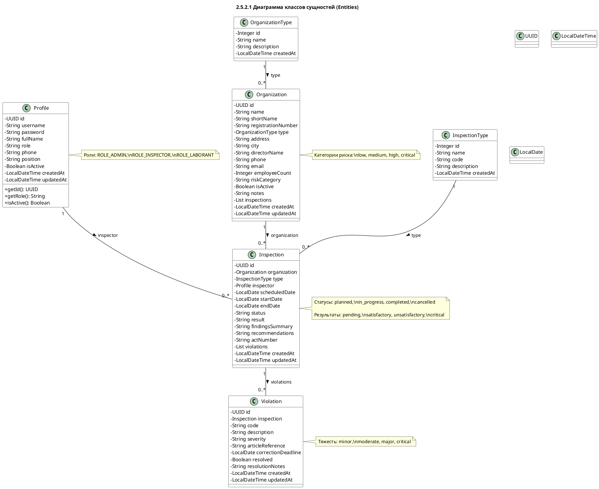

```plantuml
@startuml ClassDiagram_Entities
title 2.5.2.1 Диаграмма классов сущностей (Entities)

skinparam classAttributeIconSize 0
skinparam class {
    BackgroundColor White
    BorderColor Black
    ArrowColor Black
}

class UUID {
}

class LocalDateTime {
}

class LocalDate {
}

class Profile {
    -UUID id
    -String username
    -String password
    -String fullName
    -String role
    -String phone
    -String position
    -Boolean isActive
    -LocalDateTime createdAt
    -LocalDateTime updatedAt
    +getId(): UUID
    +getRole(): String
    +isActive(): Boolean
}

class OrganizationType {
    -Integer id
    -String name
    -String description
    -LocalDateTime createdAt
}

class Organization {
    -UUID id
    -String name
    -String shortName
    -String registrationNumber
    -OrganizationType type
    -String address
    -String city
    -String directorName
    -String phone
    -String email
    -Integer employeeCount
    -String riskCategory
    -Boolean isActive
    -String notes
    -List inspections
    -LocalDateTime createdAt
    -LocalDateTime updatedAt
}

class InspectionType {
    -Integer id
    -String name
    -String code
    -String description
    -LocalDateTime createdAt
}

class Inspection {
    -UUID id
    -Organization organization
    -InspectionType type
    -Profile inspector
    -LocalDate scheduledDate
    -LocalDate startDate
    -LocalDate endDate
    -String status
    -String result
    -String findingsSummary
    -String recommendations
    -String actNumber
    -List violations
    -LocalDateTime createdAt
    -LocalDateTime updatedAt
}

class Violation {
    -UUID id
    -Inspection inspection
    -String code
    -String description
    -String severity
    -String articleReference
    -LocalDate correctionDeadline
    -Boolean resolved
    -String resolutionNotes
    -LocalDateTime createdAt
    -LocalDateTime updatedAt
}

Profile "1" -- "0..*" Inspection : inspector >
OrganizationType "1" -- "0..*" Organization : type >
Organization "1" -- "0..*" Inspection : organization >
InspectionType "1" -- "0..*" Inspection : type >
Inspection "1" -- "0..*" Violation : violations >

note right of Profile
  Роли: ROLE_ADMIN,\nROLE_INSPECTOR,\nROLE_LABORANT
end note

note right of Organization
  Категории риска:\nlow, medium, high, critical
end note

note right of Inspection
  Статусы: planned,\nin_progress, completed,\ncancelled
  
  Результаты: pending,\nsatisfactory, unsatisfactory,\ncritical
end note

note right of Violation
  Тяжесть: minor,\nmoderate, major, critical
end note

@enduml
```
