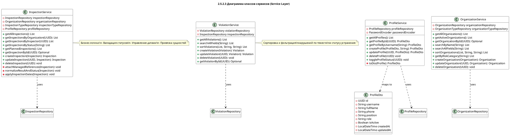

```plantuml
@startuml ClassDiagram_Services
title 2.5.2.3 Диаграмма классов сервисов (Service Layer)

skinparam class {
    BackgroundColor White
    BorderColor Black
    ArrowColor Black
}

class "ProfileService" as ProfileService {
    -ProfileRepository profileRepository
    -PasswordEncoder passwordEncoder
    +getAllProfiles(): List
    +getProfileById(UUID): ProfileDto
    +getProfileByUsername(String): ProfileDto
    +createProfile(ProfileDto, String): ProfileDto
    +updateProfile(UUID, ProfileDto): ProfileDto
    +deleteProfile(UUID): void
    +toggleProfileStatus(UUID): void
    -toDto(Profile): ProfileDto
}

class "OrganizationService" as OrgService {
    -OrganizationRepository organizationRepository
    -OrganizationTypeRepository organizationTypeRepository
    +getAllOrganizations(): List
    +getActiveOrganizations(): List
    +getOrganizationById(UUID): Optional
    +searchByName(String): List
    +searchAllFields(String): List
    +sortOrganizations(List, String, String): List
    +getByRiskCategory(String): List
    +createOrganization(Organization): Organization
    +updateOrganization(UUID, Organization): Organization
    +deleteOrganization(UUID): void
}

class "InspectionService" as InspService {
    -InspectionRepository inspectionRepository
    -OrganizationRepository organizationRepository
    -InspectionTypeRepository inspectionTypeRepository
    -ProfileRepository profileRepository
    +getAllInspections(): List
    +getInspectionsByOrganization(UUID): List
    +getInspectionsByInspector(UUID): List
    +getInspectionsByStatus(String): List
    +getPlannedInspections(): List
    +getInspectionById(UUID): Optional
    +createInspection(Inspection): Inspection
    +updateInspection(UUID, Inspection): Inspection
    +deleteInspection(UUID): void
    -attachManagedReferences(Inspection): void
    -normalizeResultAndStatus(Inspection): void
    -applyInspectionDates(Inspection): void
}

class "ViolationService" as ViolService {
    -ViolationRepository violationRepository
    -InspectionRepository inspectionRepository
    +getAllViolations(): List
    +searchAllFields(String): List
    +sortViolations(List, String, String): List
    +createViolation(Violation): Violation
    +updateViolation(UUID, Violation): Violation
    +deleteViolation(UUID): void
    +getViolationById(UUID): Optional
}

class "ProfileDto" as ProfileDto {
    -UUID id
    -String username
    -String fullName
    -String phone
    -String position
    -String role
    -Boolean isActive
    -LocalDateTime createdAt
    -LocalDateTime updatedAt
}

ProfileService ..> ProfileDto : maps to
ProfileService ..> ProfileRepository : uses
OrgService ..> OrganizationRepository : uses
InspService ..> InspectionRepository : uses
ViolService ..> ViolationRepository : uses

note right of InspService
  Бизнес-логика:\n- Валидация статусов\n- Управление датами\n- Привязка сущностей
end note

note right of ViolService
  Сортировка и фильтрация\nнарушений по тяжести\nи статусу устранения
end note

@enduml
```
