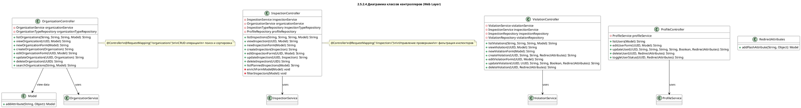

```plantuml
@startuml ClassDiagram_Controllers
title 2.5.2.4 Диаграмма классов контроллеров (Web Layer)

skinparam class {
    BackgroundColor White
    BorderColor Black
    ArrowColor Black
}

class "OrganizationController" as OrgCtrl {
    -OrganizationService organizationService
    -OrganizationTypeRepository organizationTypeRepository
    +listOrganizations(String, String, String, Model): String
    +viewOrganization(UUID, Model): String
    +newOrganizationForm(Model): String
    +createOrganization(Organization): String
    +editOrganizationForm(UUID, Model): String
    +updateOrganization(UUID, Organization): String
    +deleteOrganization(UUID): String
    +searchOrganizations(String, Model): String
}

class "InspectionController" as InspCtrl {
    -InspectionService inspectionService
    -OrganizationService organizationService
    -InspectionTypeRepository inspectionTypeRepository
    -ProfileRepository profileRepository
    +listInspections(String, String, String, Model): String
    +viewInspection(UUID, Model): String
    +newInspectionForm(Model): String
    +createInspection(Inspection): String
    +editInspectionForm(UUID, Model): String
    +updateInspection(UUID, Inspection): String
    +deleteInspection(UUID): String
    +listPlannedInspections(Model): String
    -enrichFormModel(Model): void
    -filterInspectors(Model): void
}

class "ViolationController" as ViolCtrl {
    -ViolationService violationService
    -InspectionService inspectionService
    -InspectionRepository inspectionRepository
    -ViolationRepository violationRepository
    +listViolations(String, String, String, Model): String
    +viewViolation(UUID, Model): String
    +newViolationForm(Model): String
    +createViolation(UUID, String, String, RedirectAttributes): String
    +editViolationForm(UUID, Model): String
    +updateViolation(UUID, UUID, String, String, Boolean, RedirectAttributes): String
    +deleteViolation(UUID, RedirectAttributes): String
}

class "ProfileController" as ProfileCtrl {
    -ProfileService profileService
    +listUsers(Model): String
    +editUserForm(UUID, Model): String
    +updateUser(UUID, String, String, String, String, Boolean, RedirectAttributes): String
    +deleteUser(UUID, RedirectAttributes): String
    +toggleUserStatus(UUID, RedirectAttributes): String
}

class "Model" as Model {
    +addAttribute(String, Object): Model
}

class "RedirectAttributes" as RedirectAttr {
    +addFlashAttribute(String, Object): Model
}

OrgCtrl --> Model : view data
OrgCtrl --> OrganizationService : uses
InspCtrl --> InspectionService : uses
ViolCtrl --> ViolationService : uses
ProfileCtrl --> ProfileService : uses

note right of OrgCtrl
  @Controller\n@RequestMapping("/organizations")\n\nCRUD операции\n+ поиск и сортировка
end note

note right of InspCtrl
  @Controller\n@RequestMapping("/inspections")\n\nУправление проверками\n+ фильтрация инспекторов
end note

@enduml
```
