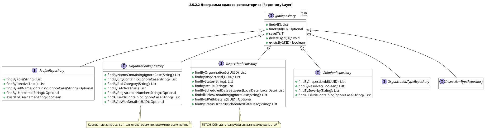

```plantuml
@startuml ClassDiagram_Repositories
title 2.5.2.2 Диаграмма классов репозиториев (Repository Layer)

skinparam class {
    BackgroundColor White
    BorderColor Black
    ArrowColor Black
}

interface "JpaRepository<T, ID>" as JpaRepository {
    +findAll(): List
    +findById(ID): Optional
    +save(T): T
    +deleteById(ID): void
    +existsById(ID): boolean
}

interface "ProfileRepository" as ProfileRepo {
    +findByRole(String): List
    +findByIsActiveTrue(): List
    +findByFullNameContainingIgnoreCase(String): Optional
    +findByUsername(String): Optional
    +existsByUsername(String): boolean
}

interface "OrganizationRepository" as OrgRepo {
    +findByNameContainingIgnoreCase(String): List
    +findByCityContainingIgnoreCase(String): List
    +findByRiskCategory(String): List
    +findByIsActiveTrue(): List
    +findByRegistrationNumber(String): Optional
    +findAllFieldsContainingIgnoreCase(String): List
    +findByIdWithDetails(UUID): Optional
}

interface "InspectionRepository" as InspRepo {
    +findByOrganizationId(UUID): List
    +findByInspectorId(UUID): List
    +findByStatus(String): List
    +findByResult(String): List
    +findByScheduledDateBetween(LocalDate, LocalDate): List
    +findAllFieldsContainingIgnoreCase(String): List
    +findByIdWithDetails(UUID): Optional
    +findByStatusOrderByScheduledDateDesc(String): List
}

interface "ViolationRepository" as ViolRepo {
    +findByInspectionId(UUID): List
    +findByResolved(Boolean): List
    +findBySeverity(String): List
    +findAllFieldsContainingIgnoreCase(String): List
}

interface "OrganizationTypeRepository" as OrgTypeRepo {
}

interface "InspectionTypeRepository" as InspTypeRepo {
}

JpaRepository <|-- ProfileRepo
JpaRepository <|-- OrgRepo
JpaRepository <|-- InspRepo
JpaRepository <|-- ViolRepo
JpaRepository <|-- OrgTypeRepo
JpaRepository <|-- InspTypeRepo

note bottom of OrgRepo
  Кастомные запросы с\nполнотекстовым поиском\nпо всем полям
end note

note bottom of InspRepo
  FETCH JOIN для\nзагрузки связанных\nсущностей
end note

@enduml
```
