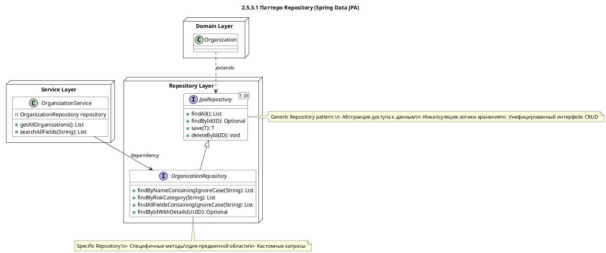

```plantuml
@startuml GoF_Repository_Pattern
title 2.5.3.1 Паттерн Repository (Spring Data JPA)

skinparam class {
    BackgroundColor White
    BorderColor Black
}

node "Domain Layer" {
    class "Organization" as Entity
}

node "Repository Layer" {
    interface "JpaRepository<T, ID>" as JpaRepository {
        +findAll(): List
        +findById(ID): Optional
        +save(T): T
        +deleteById(ID): void
    }
    
    interface "OrganizationRepository" as OrgRepo {
        +findByNameContainingIgnoreCase(String): List
        +findByRiskCategory(String): List
        +findAllFieldsContainingIgnoreCase(String): List
        +findByIdWithDetails(UUID): Optional
    }
}

node "Service Layer" {
    class "OrganizationService" as Service {
        -OrganizationRepository repository
        +getAllOrganizations(): List
        +searchAllFields(String): List
    }
}

Entity ..> JpaRepository : extends
JpaRepository <|-- OrgRepo
Service --> OrgRepo : dependency

note right of JpaRepository
  Generic Repository pattern:\n- Абстракция доступа к данным\n- Инкапсуляция логики хранения\n- Унифицированный интерфейс CRUD
end note

note bottom of OrgRepo
  Specific Repository:\n- Специфичные методы\nдля предметной области\n- Кастомные запросы
end note

@enduml
```
