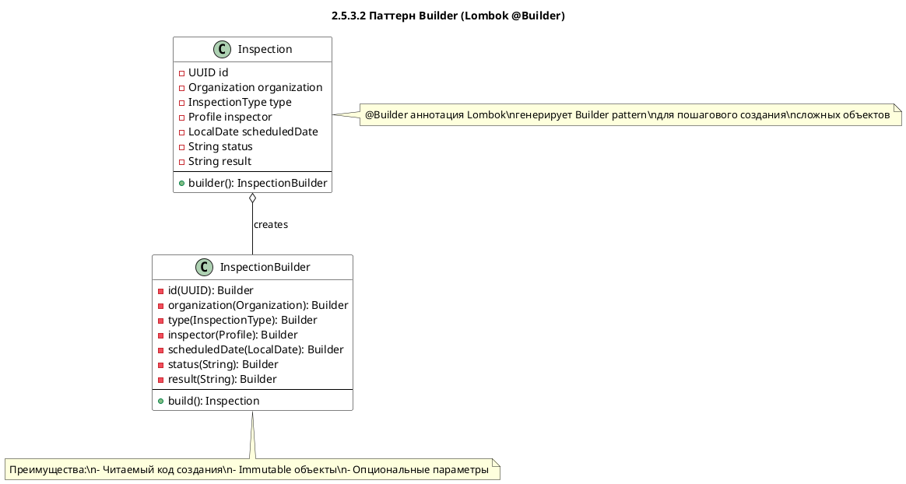

```plantuml
@startuml GoF_Builder_Pattern
title 2.5.3.2 Паттерн Builder (Lombok @Builder)

skinparam class {
    BackgroundColor White
    BorderColor Black
}

class "Inspection" as Inspection {
    -UUID id
    -Organization organization
    -InspectionType type
    -Profile inspector
    -LocalDate scheduledDate
    -String status
    -String result
    --
    +builder(): InspectionBuilder
}

class "InspectionBuilder" as Builder {
    -id(UUID): Builder
    -organization(Organization): Builder
    -type(InspectionType): Builder
    -inspector(Profile): Builder
    -scheduledDate(LocalDate): Builder
    -status(String): Builder
    -result(String): Builder
    --
    +build(): Inspection
}

Inspection o-- Builder : creates

note right of Inspection
  @Builder аннотация Lombok\nгенерирует Builder pattern\nдля пошагового создания\nсложных объектов
end note

note bottom of Builder
  Преимущества:\n- Читаемый код создания\n- Immutable объекты\n- Опциональные параметры
end note

@enduml
```
