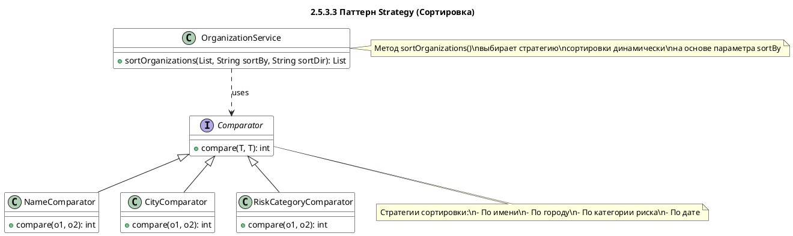

```plantuml
@startuml GoF_Strategy_Pattern
title 2.5.3.3 Паттерн Strategy (Сортировка)

skinparam class {
    BackgroundColor White
    BorderColor Black
}

interface "Comparator" as Comparator {
    +compare(T, T): int
}

class "OrganizationService" as Context {
    +sortOrganizations(List, String sortBy, String sortDir): List
}

class "NameComparator" as NameStrategy {
    +compare(o1, o2): int
}

class "CityComparator" as CityStrategy {
    +compare(o1, o2): int
}

class "RiskCategoryComparator" as RiskStrategy {
    +compare(o1, o2): int
}

Context ..> Comparator : uses
Comparator <|-- NameStrategy
Comparator <|-- CityStrategy
Comparator <|-- RiskStrategy

note right of Context
  Метод sortOrganizations()\nвыбирает стратегию\nсортировки динамически\nна основе параметра sortBy
end note

note bottom of Comparator
  Стратегии сортировки:\n- По имени\n- По городу\n- По категории риска\n- По дате
end note

@enduml
```
