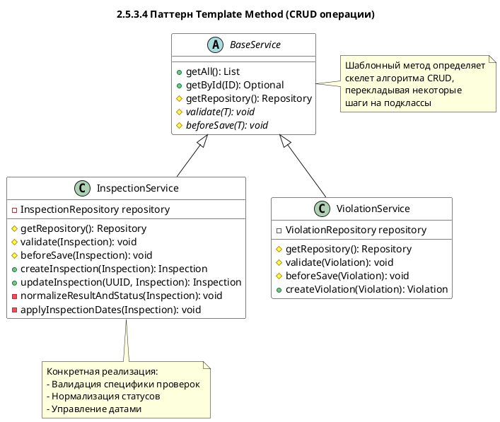

```plantuml
@startuml GoF_Template_Method
title 2.5.3.4 Паттерн Template Method (CRUD операции)

skinparam class {
    BackgroundColor White
    BorderColor Black
}

abstract class "BaseService" as BaseService {
    +getAll(): List
    +getById(ID): Optional
    #getRepository(): Repository
    {abstract} #validate(T): void
    {abstract} #beforeSave(T): void
}

class "InspectionService" as ConcreteService {
    -InspectionRepository repository
    #getRepository(): Repository
    #validate(Inspection): void
    #beforeSave(Inspection): void
    +createInspection(Inspection): Inspection
    +updateInspection(UUID, Inspection): Inspection
    -normalizeResultAndStatus(Inspection): void
    -applyInspectionDates(Inspection): void
}

class "ViolationService" as ViolService {
    -ViolationRepository repository
    #getRepository(): Repository
    #validate(Violation): void
    #beforeSave(Violation): void
    +createViolation(Violation): Violation
}

BaseService <|-- ConcreteService
BaseService <|-- ViolService

note right of BaseService
    Шаблонный метод определяет
    скелет алгоритма CRUD,
    перекладывая некоторые
    шаги на подклассы
end note

note bottom of ConcreteService
    Конкретная реализация:
    - Валидация специфики проверок
    - Нормализация статусов
    - Управление датами
end note
@enduml
```
