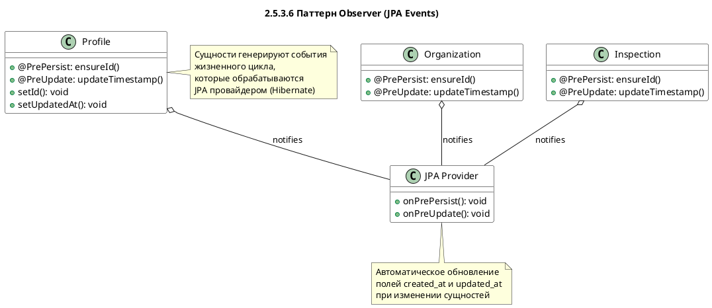

```plantuml
@startuml GoF_Observer_Pattern
title 2.5.3.6 Паттерн Observer (JPA Events)

skinparam class {
    BackgroundColor White
    BorderColor Black
}

class "Profile" as Subject {
    +@PrePersist: ensureId()
    +@PreUpdate: updateTimestamp()
    +setId(): void
    +setUpdatedAt(): void
}

class "Organization" as Subject2 {
    +@PrePersist: ensureId()
    +@PreUpdate: updateTimestamp()
}

class "Inspection" as Subject3 {
    +@PrePersist: ensureId()
    +@PreUpdate: updateTimestamp()
}

class "JPA Provider" as Observer {
    +onPrePersist(): void
    +onPreUpdate(): void
}

Subject o-- Observer : notifies
Subject2 o-- Observer : notifies
Subject3 o-- Observer : notifies

note right of Subject
    Сущности генерируют события
    жизненного цикла,
    которые обрабатываются
    JPA провайдером (Hibernate)
end note

note bottom of Observer
    Автоматическое обновление
    полей created_at и updated_at
    при изменении сущностей
end note
@enduml
```
