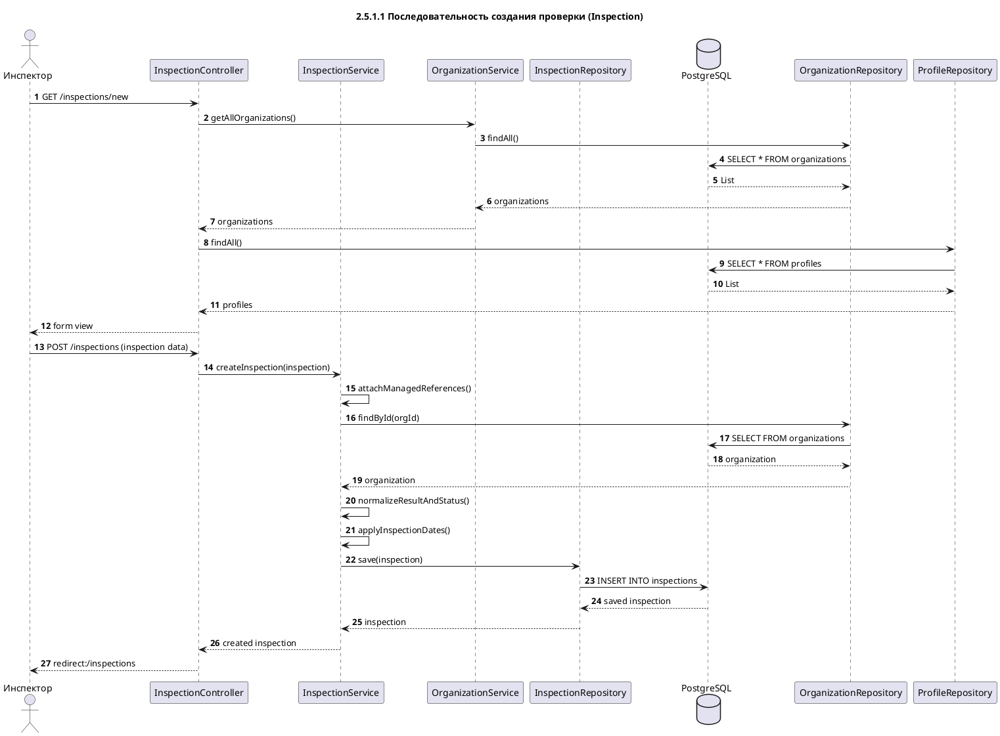

```plantuml
@startuml Sequence_CreateInspection
title 2.5.1.1 Последовательность создания проверки (Inspection)

autonumber
actor "Инспектор" as Inspector
participant "InspectionController" as Controller
participant "InspectionService" as Service
participant "OrganizationService" as OrgService
participant "InspectionRepository" as Repo
database "PostgreSQL" as DB
participant "OrganizationRepository" as OrgRepo
participant "ProfileRepository" as ProfileRepo

Inspector -> Controller : GET /inspections/new
Controller -> OrgService : getAllOrganizations()
OrgService -> OrgRepo : findAll()
OrgRepo -> DB : SELECT * FROM organizations
DB --> OrgRepo : List
OrgRepo --> OrgService : organizations
OrgService --> Controller : organizations

Controller -> ProfileRepo : findAll()
ProfileRepo -> DB : SELECT * FROM profiles
DB --> ProfileRepo : List
ProfileRepo --> Controller : profiles

Controller --> Inspector : form view

Inspector -> Controller : POST /inspections (inspection data)
Controller -> Service : createInspection(inspection)

Service -> Service : attachManagedReferences()
Service -> OrgRepo : findById(orgId)
OrgRepo -> DB : SELECT FROM organizations
DB --> OrgRepo : organization
OrgRepo --> Service : organization

Service -> Service : normalizeResultAndStatus()
Service -> Service : applyInspectionDates()

Service -> Repo : save(inspection)
Repo -> DB : INSERT INTO inspections
DB --> Repo : saved inspection
Repo --> Service : inspection

Service --> Controller : created inspection
Controller --> Inspector : redirect:/inspections

@enduml
```