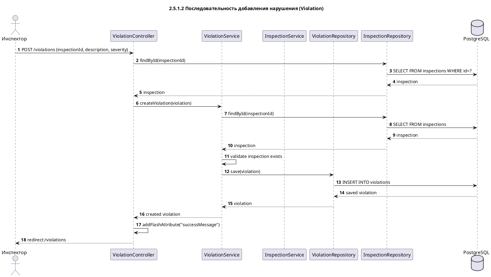

```plantuml
@startuml Sequence_AddViolation
title 2.5.1.2 Последовательность добавления нарушения (Violation)

autonumber
actor "Инспектор" as Inspector
participant "ViolationController" as Controller
participant "ViolationService" as Service
participant "InspectionService" as InspService
participant "ViolationRepository" as ViolRepo
participant "InspectionRepository" as InspRepo
database "PostgreSQL" as DB

Inspector -> Controller : POST /violations (inspectionId, description, severity)

Controller -> InspRepo : findById(inspectionId)
InspRepo -> DB : SELECT FROM inspections WHERE id=?
DB --> InspRepo : inspection
InspRepo --> Controller : inspection

Controller -> Service : createViolation(violation)

Service -> InspRepo : findById(inspectionId)
InspRepo -> DB : SELECT FROM inspections
DB --> InspRepo : inspection
InspRepo --> Service : inspection

Service -> Service : validate inspection exists

Service -> ViolRepo : save(violation)
ViolRepo -> DB : INSERT INTO violations
DB --> ViolRepo : saved violation
ViolRepo --> Service : violation

Service --> Controller : created violation

Controller -> Controller : addFlashAttribute("successMessage")
Controller --> Inspector : redirect:/violations

@enduml
```
