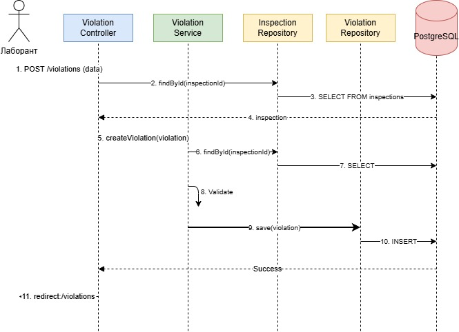
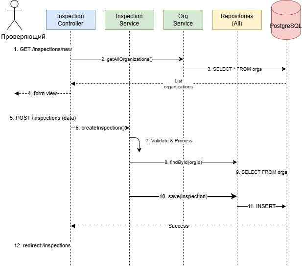
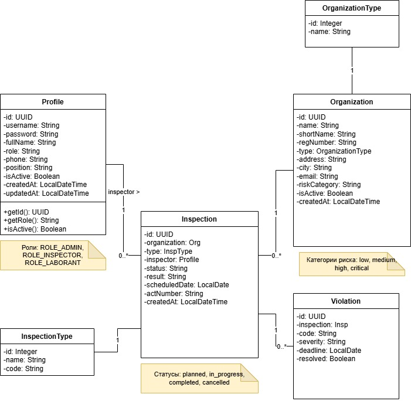
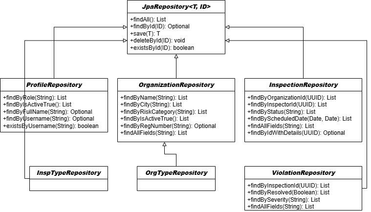
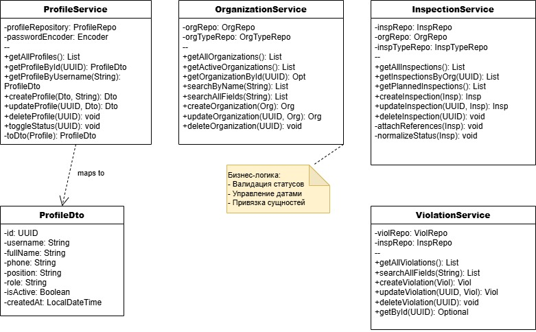
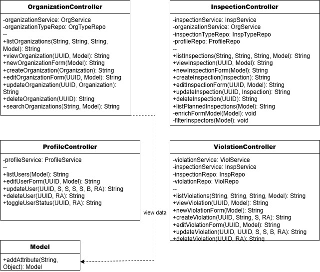

# Диаграммы последовательности

**Проект:** Информационная система Центра гигиены и эпидемиологии
**Репозиторий:** https://github.com/kkirshenko/epidemiological_center  
**Дата:** 01.06.2026

---

## Диаграммы последовательности

Диаграммы последовательности демонстрируют взаимодействие компонентов системы при выполнении двух ключевых сценариев: создание нарушения и создание проверки.

---

## Сценарий 1: Добавление нарушения (Лаборант)

### Участники
- **Лаборант** — пользователь, добавляющий нарушение
- **Violation Controller** — контроллер для обработки запросов
- **Violation Service** — сервисный слой бизнес-логики
- **Inspection Repository** — репозиторий проверок
- **Violation Repository** — репозиторий нарушений
- **PostgreSQL** — база данных

### Поток выполнения

**Фаза 1: Поиск связанной проверки**
Лаборант → Violation Controller: POST /violations (data)
Violation Controller → Violation Service: findById(inspectionId)
Violation Service → Inspection Repository: SELECT FROM inspections
Inspection Repository → PostgreSQL: запрос

**Фаза 2: Создание и сохранение нарушения**
Violation Controller → Violation Service: createViolation(violation)
Violation Service → Inspection Repository: findById(inspectionId)
Violation Service → Violation Service: validate()
Violation Service → Violation Repository: save(violation)
Violation Repository → PostgreSQL: INSERT

**Фаза 3: Завершение**
PostgreSQL → Violation Controller: Success
Violation Controller → Лаборант: redirect:/violations

---

## Сценарий 2: Создание проверки (Проверяющий)

### Участники
- **Проверяющий** — инспектор, создающий проверку
- **Inspection Controller** — контроллер проверок
- **Inspection Service** — сервис проверок
- **Org Service** — сервис организаций
- **Repositories (All)** — репозитории
- **PostgreSQL** — база данных

### Поток выполнения

**Фаза 1: Отображение формы создания**
Проверяющий → Inspection Controller: GET /inspections/new
Inspection Controller → Org Service: getAllOrganizations()
Org Service → Repositories: SELECT * FROM orgs
Repositories → PostgreSQL: запрос
PostgreSQL → Org Service: List<Organization>
Org Service → Inspection Controller: список организаций
Inspection Controller → Проверяющий: form view

**Фаза 2: Обработка данных формы**
Проверяющий → Inspection Controller: POST /inspections (data)
Inspection Controller → Inspection Service: createInspection()
Inspection Service → Inspection Service: validate & process
Inspection Service → Repositories: findById(orgId)
Repositories → PostgreSQL: SELECT FROM orgs
PostgreSQL → Repositories: Organization
Inspection Service → Repositories: save(inspection)
Repositories → PostgreSQL: INSERT
PostgreSQL → Inspection Controller: Success
Inspection Controller → Проверяющий: redirect:/inspections

---

# Диаграммы классов

Диаграммы классов демонстрируют реализацию многоуровневой архитектуры **PCMEF** с чётким разделением ответственности между слоями:

- **Entity** — доменная модель (сущности JPA)
- **Foundation** — репозитории для доступа к данным
- **Control** — контроллеры для обработки HTTP-запросов
- **Mediator** — сервисы с бизнес-логикой

---

## 1. Слой Entity (Доменная модель)
Описывает бизнес-сущности, их атрибуты, методы и связи. Реализует уровень **Entity (E)** паттерна PCMEF.

### Основные сущности
| Класс | Назначение | Ключевые атрибуты | Связи |
|-------|------------|-------------------|-------|
| `Profile` | Учётные записи сотрудников | `id`, `username`, `password`, `role`, `isActive` | `1 → N` Inspection (inspector) |
| `Organization` | Реестр поднадзорных объектов | `id`, `name`, `regNumber`, `riskCategory`, `isActive` | `N → 1` OrganizationType |
| `Inspection` | Журнал проверок | `id`, `type`, `status`, `result`, `scheduledDate`, `actNumber` | `N → 1` Organization, Profile, InspectionType |
| `Violation` | Учёт нарушений | `id`, `code`, `severity`, `deadline`, `resolved` | `N → 1` Inspection |

### Справочники
- `OrganizationType`, `InspectionType` — нормализация типов через отдельные таблицы.
- **Примечания:** Роли (`ROLE_ADMIN`, `ROLE_INSPECTOR`, `ROLE_LABORANT`), статусы проверок (`planned`, `in_progress`, `completed`, `cancelled`), категории риска (`low`, `medium`, `high`, `critical`).

---

## 2. Слой Foundation (Репозитории)
Абстракция доступа к данным. Наследует `JpaRepository<T, ID>`, предоставляя базовые CRUD-операции и кастомные запросы.

| Репозиторий | Специализированные методы | Назначение |
|-------------|---------------------------|------------|
| `ProfileRepository` | `findByRole()`, `findByIsActiveTrue()`, `existsByUsername()` | Аутентификация, фильтрация пользователей |
| `OrganizationRepository` | `findByCity()`, `findByRiskCategory()`, `findByRegNumber()`, `findAllFields()` | Поиск и фильтрация организаций |
| `InspectionRepository` | `findByOrganizationId()`, `findByStatus()`, `findByScheduledDate()`, `findByIdWithDetails()` | Загрузка проверок с оптимизацией (JOIN FETCH) |
| `ViolationRepository` | `findByInspectionId()`, `findByResolved()`, `findBySeverity()` | Выборка нарушений по проверке и статусу |

**Особенности:** Использование Spring Data JPA query derivation, отсутствие явной реализации SQL, прозрачная работа с PostgreSQL.

---

## 3. Слой Control (Контроллеры)
Обработка HTTP-запросов, рендеринг Thymeleaf-шаблонов, валидация форм. Реализует уровень **Control (C)**.

| Контроллер | Зависимости | Основные методы |
|------------|-------------|-----------------|
| `OrganizationController` | `OrgService`, `OrgTypeRepo` | `listOrganizations()`, `new/editOrganizationForm()`, `create/update/delete()`, `searchOrganizations()` |
| `InspectionController` | `InspService`, `OrgService`, `InspTypeRepo`, `ProfileRepo` | `listInspections()`, `new/editInspectionForm()`, `create/update/delete()`, `enrichFormModel()`, `filterInspectors()` |
| `ProfileController` | `ProfileService` | `listUsers()`, `editUserForm()`, `updateUser()`, `deleteUser()`, `toggleUserStatus()` |
| `ViolationController` | `ViolService`, `InspService`, `InspRepo`, `ViolRepo` | `listViolations()`, `new/editViolationForm()`, `create/update/delete()` |

**Шаблон взаимодействия:** `GET` → форма (`Form(Model)`) → `POST` → обработка → `redirect`. Используется `Model` для передачи данных в представления.

---

## 4. Слой Mediator (Сервисы)
Концентрация бизнес-логики, транзакций, валидации правил. Реализует уровень **Mediator (M)**.

| Сервис | Зависимости | Ключевые операции |
|--------|-------------|-------------------|
| `ProfileService` | `ProfileRepo`, `Encoder` | CRUD пользователей, `toggleStatus()`, маппинг `Profile → ProfileDto` |
| `OrganizationService` | `OrgRepo`, `OrgTypeRepo` | Поиск по полям, `getActiveOrganizations()`, CRUD организаций |
| `InspectionService` | `InspRepo`, `OrgRepo`, `InspTypeRepo` | `getPlannedInspections()`, `attachReferences()`, `normalizeStatus()`, управление датами |
| `ViolationService` | `ViolRepo`, `InspRepo` | Поиск по полям, CRUD нарушений, привязка к проверкам |

**Бизнес-логика (вынесена в Service):**
- Валидация статусов и переходов
- Управление датами и дедлайнами
- Привязка сущностей перед сохранением
- Преобразование Entity → DTO для представления

---

## Взаимосвязь слоёв
Browser → Controller → Service → Repository → PostgreSQL
↑ ↑ ↑
Model DTO JpaRepository