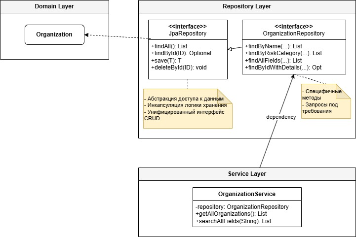
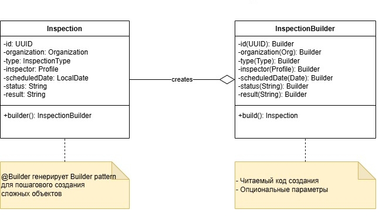
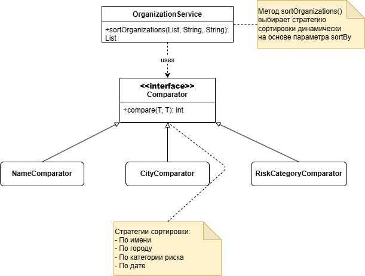
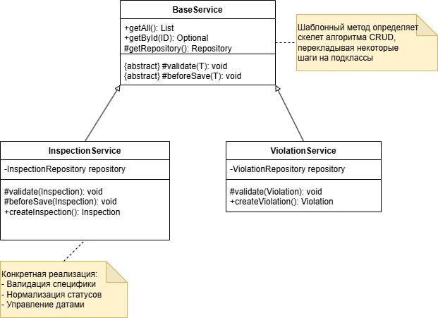
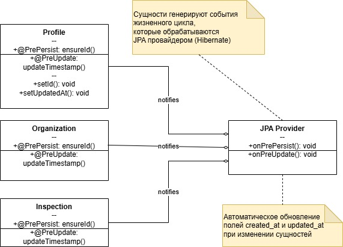

# Паттерны проектирования в проекте

**Проект:** Информационная система Центра гигиены и эпидемиологии
**Репозиторий:** https://github.com/kkirshenko/epidemiological_center  
**Дата:** 01.06.2026

---

## 1. Repository (Репозиторий)

### Назначение
Паттерн инкапсулирует логику доступа к данным, предоставляя коллекции-подобный интерфейс для работы с доменными объектами и скрывая детали реализации хранилища (SQL, ORM, кэширование).

### Реализация в проекте
Реализован через наследование от `JpaRepository<T, ID>` с расширением кастомными методами для специфических запросов.

**Структура:**
- **`JpaRepository`** (базовый интерфейс): Предоставляет стандартные CRUD-операции (`findAll()`, `findById()`, `save()`, `deleteById()`) и пагинацию
- **`OrganizationRepository`** (специализированный интерфейс): Расширяет базовый репозиторий методами Derived Query (`findByName()`, `findByRiskCategory()`) и `@Query` для сложных выборок с JOIN FETCH
- **`OrganizationService`** (клиент): Зависит от абстракции репозитория, а не от конкретной реализации

---

## 2. Builder (Строитель)

### Назначение
Паттерн обеспечивает пошаговое создание сложных объектов с большим количеством параметров, избегая перегруженных конструкторов и улучшая читаемость кода инициализации.

### Реализация в проекте
Паттерн реализован через аннотацию Lombok `@Builder`, которая на этапе компиляции генерирует внутренний класс-строитель с fluent-интерфейсом.

**Структура:**
- **Целевой класс (`Inspection`)**: Содержит поля сущности и метод `builder()`, возвращающий экземпляр строителя.
- **Генерируемый `InspectionBuilder`**: Предоставляет цепочечные методы для каждого поля (`id()`, `organization()`, `type()`, `status()` и т.д.) и финальный метод `build()`, создающий неизменяемый экземпляр `Inspection`.

---

## 3. Strategy (Стратегия)

### Назначение
Позволяет выбирать алгоритм сортировки организаций динамически на основе параметра.

### Структура
- **OrganizationService**:
  - `sortOrganizations(List, String, String): List` — выбирает стратегию сортировки

- **Comparator** (интерфейс):
  - `compare(T, T): int`

- **Конкретные стратегии**:
  - `NameComparator` — сортировка по имени
  - `CityComparator` — сортировка по городу
  - `RiskCategoryComparator` — сортировка по категории риска

---

## 4. Template Method (Шаблонный метод)

### Назначение
Определяет скелет алгоритма CRUD-операций в базовом классе, перекладывая некоторые шаги на подклассы.

### Структура
- **BaseService** (абстрактный) — определяет шаблон:
  - `getAll(): List`
  - `getById(ID): Optional`
  - `getRepository(): Repository`
  - `{abstract} validate(T): void`
  - `{abstract} beforeSave(T): void`

- **InspectionService** — конкретная реализация:
  - `validate(Inspection): void` — валидация специфики проверки
  - `beforeSave(Inspection): void` — нормализация статусов, управление датами
  - `createInspection(): Inspection`

- **ViolationService** — конкретная реализация:
  - `validate(Violation): void`
  - `beforeSave(Violation): void`
  - `createViolation(): Violation`

### Преимущества
- Устраняет дублирование кода CRUD-операций
- Централизует общую логику в BaseService
- Позволяет кастомизировать валидацию и предобработку

---

## 5. Observer (Наблюдатель)

### Назначение
Автоматическое отслеживание и реакция на изменения состояния сущностей без явного вызова сервисных методов в бизнес-логике. В проекте используется для автоматического обновления временных меток аудита.

### Реализация в проекте
Механизм реализован через **JPA Entity Listeners** и аннотации жизненного цикла Hibernate:
- `@PrePersist`: Вызывается перед первой записью сущности в БД. Используется для генерации UUID и установки `createdAt`.
- `@PreUpdate`: Вызывается перед обновлением существующей записи. Используется для обновления `updatedAt`.

---
