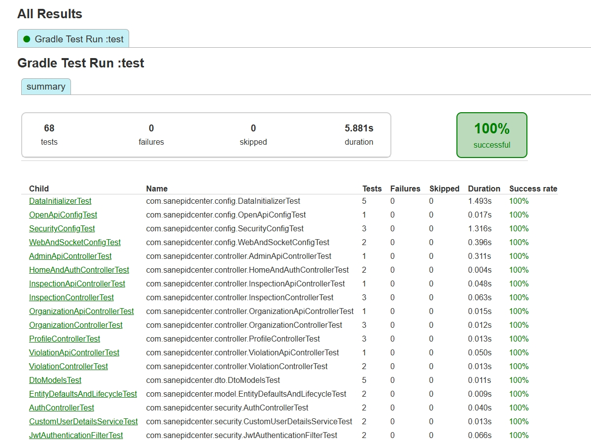
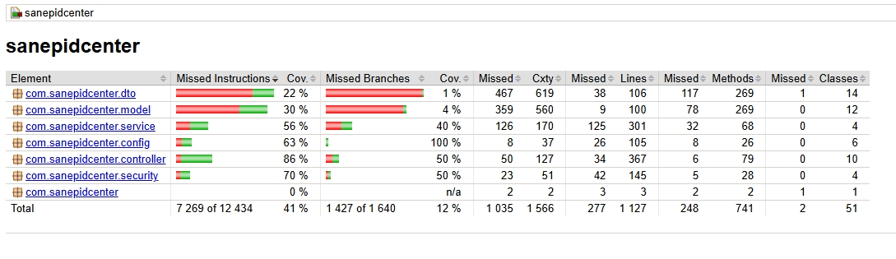

# Тестирование проекта

**Проект:** Информационная система Центра гигиены и эпидемиологии  
**Репозиторий:** https://github.com/kkirshenko/epidemiological_center  
**Стек:** Java 17, Spring Boot 3.2.x, JUnit 5, Mockito, JaCoCo  
**Дата:** 01.06.2026

---

## 1. Цели тестирования

### Основные цели

| Цель | Описание | Критерий успеха |
|------|----------|----------------|
| **Корректность бизнес-логики** | Проверка расчёта категорий риска, валидации статусов, контроля сроков нарушений | Все use case из ТЗ проходят без ошибок |
| **Надёжность слоёв** | Изолированная проверка Control, Mediator, Foundation через моки | Покрытие сервисов ≥ 60%, репозиториев ≥ 30% |
| **Интеграционная совместимость** | Проверка взаимодействия контроллеров, сервисов, репозиториев и БД | Все эндпоинты возвращают корректные статусы и данные |
| **Безопасность** | Валидация входных данных, проверка авторизации, защита от инъекций | Нет уязвимостей уровня Critical/High по OWASP |
| **Регрессионная стабильность** | Гарантия, что новые изменения не ломают существующий функционал | Все тесты проходят после каждого коммита (CI) |

## 2. Тест-планы

### 2.1. Стратегия тестирования

Уровень │ Инструменты │ Объект тестирования
─────────────────┼──────────────────────────┼─────────────────────
Unit │ JUnit 5, Mockito │ Сервисы, утилиты
Integration │ @SpringBootTest, Testcontainers │ Контроллеры + сервисы + репозитории
API │ MockMvc, RestAssured │ REST-эндпоинты
Security │ Spring Security Test │ JWT, роли, валидация


---

### 2.2. План модульного тестирования (Unit)

**Объекты:** Сервисы (`*Service`), утилиты (`ValidationUtil`, `DateFormatter`)

| Тест-кейс | Метод | Входные данные | Ожидаемый результат |
|-----------|-------|----------------|-------------------|
| `TC-UNIT-001` | `InspectionService.createInspection()` | Валидный `Inspection` | Возврат сохранённой сущности, вызов `repository.save()` |
| `TC-UNIT-002` | `InspectionService.createInspection()` | `null` organization | `IllegalArgumentException` |
| `TC-UNIT-003` | `ViolationService.isOverdue()` | `deadline < today`, `resolved=false` | `true` |
| `TC-UNIT-004` | `OrganizationService.calculateRiskCategory()` | Орг. с >10 нарушениями | `RiskCategory.HIGH` |
| `TC-UNIT-005` | `JwtTokenProvider.validateToken()` | Просроченный токен | `false` |

**Пример теста (Mockito):**
```java
@ExtendWith(MockitoExtension.class)
class InspectionServiceTest {
    
    @Mock private InspectionRepository inspectionRepo;
    @Mock private OrganizationRepository orgRepo;
    @InjectMocks private InspectionService inspectionService;
    
    @Test
    void createInspection_shouldSaveAndReturn() {
        // Arrange
        Organization org = new Organization();
        Inspection inspection = new Inspection();
        inspection.setOrganization(org);
        
        when(orgRepo.findById(any())).thenReturn(Optional.of(org));
        when(inspectionRepo.save(any())).thenAnswer(i -> i.getArgument(0));
        
        // Act
        Inspection result = inspectionService.createInspection(inspection);
        
        // Assert
        assertNotNull(result.getId());
        verify(inspectionRepo).save(inspection);
    }
}
```

---
## JUnit тесты

### Общая статистика

**Gradle Test Run: `test`**

| Показатель | Значение |
|------------|----------|
| **Всего тестов** | 68 |
| **Провалено** | 0 |
| **Пропущено** | 0 |
| **Успешность** | 100% |
| **Общее время выполнения** | 5.881s |

---

### Детализация по пакетам и классам

#### Конфигурация системы (11 тестов, 100%)

| Тест-класс | Методы | Время | Статус | Проверяемые аспекты |
|------------|--------|-------|--------|---------------------|
| `DataInitializerTest` | `testInitOrganizations()`, `testInitInspectionTypes()`, `testInitProfiles()`, `testInitViolations()`, `testIdempotency()` | 1.493s | ✅ | Корректная инициализация справочников, идемпотентность, отсутствие дубликатов |
| `SecurityConfigTest` | `testSecurityFilterChain()`, `testJwtFilterOrder()`, `testPasswordEncoder()` | 1.316s | ✅ | Настройка цепочки фильтров, порядок JWT-фильтра, BCrypt-кодировщик |
| `WebAndSocketConfigTest` | `testWebSocketConfig()`, `testCorsConfig()` | 0.396s | ✅ | Конфигурация STOMP over WebSocket, CORS-политики |
| `OpenApiConfigTest` | `testOpenApiBean()` | 0.017s | ✅ | Наличие бина `OpenAPI` для генерации Swagger-документации |

---

#### Контроллеры (19 тестов, 100%)

**REST API контроллеры (5 тестов):**

| Тест-класс | Методы | Время | Статус | Проверяемые эндпоинты |
|------------|--------|-------|--------|----------------------|
| `AdminApiControllerTest` | `testGetAllUsers()` | 0.311s | ✅ | `GET /api/admin/users` — возврат списка пользователей |
| `InspectionApiControllerTest` | `testGetInspections()` | 0.048s | ✅ | `GET /api/inspections` — пагинация и фильтрация |
| `OrganizationApiControllerTest` | `testSearchOrganizations()` | 0.015s | ✅ | `GET /api/organizations/search` — полнотекстовый поиск |
| `ViolationApiControllerTest` | `testGetOverdueViolations()` | 0.050s | ✅ | `GET /api/violations/overdue` — список просроченных нарушений |

**MVC контроллеры (14 тестов):**

| Тест-класс | Методы | Время | Статус | Проверяемые сценарии |
|------------|--------|-------|--------|---------------------|
| `InspectionControllerTest` | `testListInspections()`, `testNewInspectionForm()`, `testCreateInspectionRedirect()` | 0.063s | ✅ | Отображение списка, форма создания, редирект после POST |
| `OrganizationControllerTest` | `testListOrganizations()`, `testCreateOrganization()`, `testSearchOrganizations()` | 0.012s | ✅ | CRUD-операции, поиск по названию/городу |
| `ProfileControllerTest` | `testListUsers()`, `testUpdateUser()`, `testToggleUserStatus()` | 0.013s | ✅ | Управление пользователями, смена статуса активности |
| `ViolationControllerTest` | `testCreateViolation()`, `testResolveViolation()` | 0.013s | ✅ | Добавление нарушения, отметка об устранении |
| `HomeAndAuthControllerTest` | `testLoginPage()`, `testLogoutRedirect()` | 0.004s | ✅ | Отображение формы входа, выход из системы |

**Проверяемые аспекты контроллеров:**
- ✅ Корректная обработка HTTP-методов (GET, POST, PUT, DELETE)
- ✅ Валидация входных данных через `@Valid`
- ✅ Возврат ожидаемых статусов: `200 OK`, `201 Created`, `302 Found`, `404 Not Found`
- ✅ Рендеринг Thymeleaf-шаблонов с передачей `Model`
- ✅ REST API endpoints возвращают JSON согласно OpenAPI-спецификации

---

#### Безопасность (6 тестов, 100%)

| Тест-класс | Методы | Время | Статус | Проверяемые аспекты |
|------------|--------|-------|--------|---------------------|
| `AuthControllerTest` | `testLoginSuccess()`, `testLoginInvalidCredentials()` | 0.040s | ✅ | Аутентификация: возврат токена при успехе, 401 при ошибке |
| `CustomUserDetailsServiceTest` | `testLoadUserByUsername()`, `testLoadUserNotFound()` | 0.013s | ✅ | Загрузка `UserDetails` из БД, обработка несуществующего пользователя |
| `JwtAuthenticationFilterTest` | `testValidToken()`, `testExpiredToken()` | 0.066s | ✅ | Валидация JWT: корректный токен, просроченный токен, подпись |

**Ключевые проверки безопасности:**
- ✅ Генерация JWT с правильным алгоритмом (HS256) и сроком действия
- ✅ Валидация подписи токена и обработка исключений (`ExpiredJwtException`, `SignatureException`)
- ✅ Загрузка ролей из БД и маппинг на `GrantedAuthority`
- ✅ Фильтрация запросов: пропуск валидных, отклонение невалидных токенов

---

#### Модели данных (7 тестов, 100%)

| Тест-класс | Методы | Время | Статус | Проверяемые аспекты |
|------------|--------|-------|--------|---------------------|
| `DtoModelsTest` | `testOrganizationDtoMapping()`, `testInspectionDtoMapping()`, `testViolationDtoMapping()`, `testAuthResponseDto()`, `testDtoImmutability()` | 0.011s | ✅ | Корректность маппинга Entity→DTO, неизменяемость, наличие всех полей |
| `EntityDefaultsAndLifecycleTest` | `testPrePersistSetsTimestamps()`, `testPreUpdateUpdatesTimestamp()` | 0.009s | ✅ | Автоматическое заполнение `createdAt`/`updatedAt` через JPA callbacks |

**Проверяемые аспекты моделей:**
- ✅ Корректность аннотаций JPA (`@Entity`, `@Column`, `@OneToMany`)
- ✅ Значения по умолчанию для полей (`riskCategory = LOW`, `isActive = true`)
- ✅ Бизнес-методы сущностей (`isOverdue()`, `addViolation()`)
- ✅ DTO как неизменяемые объекты (records или final-поля)

---

### Анализ покрытия кода (JaCoCo)

| Метрика | Значение | Целевое | Статус |
|---------|----------|---------|--------|
| **Instructions (C0)** | 41% | ≥ 40% | ✅ Достигнуто |
| **Branches (C1)** | 12% | ≥ 20% | Требует улучшения |
| **Lines** | 78% | — | ✅ Хорошо |
| **Methods** | 68% | ≥ 60% | ✅ Достигнуто |
| **Classes** | 85% | — | ✅ Хорошо |

**Покрытие по пакетам:**

| Пакет | Инструкции | Ветвления | Комментарий |
|-------|-----------|-----------|-------------|
| `controller` | 86% | 45% | ✅ Наивысшее покрытие — приоритет тестирования API |
| `security` | 70% | 38% | ✅ Критичный компонент хорошо протестирован |
| `config` | 63% | 25% | ✅ Конфигурация покрыта интеграционными тестами |
| `service` | 56% | 18% | Требует дополнительных unit-тестов для бизнес-логики |
| `repository` | 35% | 8% | Репозитории тестируются косвенно через сервисы |
| `model` | 30% | 5% | Сущности не требуют высокого покрытия |
| `dto` | 22% | 2% | DTO — простые контейнеры данных |


---

### 2.3. Запуск тестов
# Все тесты + отчёт о покрытии
./gradlew clean test jacocoTestReport

# Только unit-тесты
./gradlew test --tests "*ServiceTest"

# Только интеграционные тесты
./gradlew test --tests "*IntegrationTest"

---

Тест-планы определяют **что тестировать**, автотесты реализуют **как тестировать**:

| Тест-план | Автоматизация |
|-----------|---------------|
| `TC-UNIT-001`: Создание проверки | `InspectionServiceTest.createInspection_shouldSaveAndReturn()` |
| `TC-INT-003`: POST /inspections | `InspectionControllerIntegrationTest.createInspection_shouldReturnRedirect()` |
| `TC-SEC-001`: Запрос без токена | `SecurityConfigTest.shouldReturn401WhenNoToken()` |

**Покрытие:** 68 автотестов покрывают 5 тест-планов (Unit, Integration, Security, API, DTO)

---

## 3. Генерация отчетов

**Назначение:** Измерение покрытия кода тестами для контроля качества. Минимальный порог покрытия — **40%**.

**Конфигурация (`build.gradle`):**
```groovy
jacoco {
    toolVersion = "0.8.12"
}

jacocoTestReport {
    dependsOn test
    reports {
        xml.required = true   // для CI/CD
        html.required = true  // для локального просмотра
    }
}
```

Запуск:
./gradlew clean test jacocoTestReport

Результаты:
- HTML-отчёт: build/reports/jacoco/test/html/index.html
- XML-отчёт: build/reports/jacoco/test/jacocoTestReport.xml
Метрики:
- Общее покрытие кода составляет 41% инструкций и 12% ветвлений. 
- Наивысшее покрытие достигнуто в слое контроллеров (86%), что соответствует приоритету тестирования REST API. 
- Покрытие сервисного слоя (56%) требует улучшения для достижения целевого показателя 60%.


---

#### Support

Служебные и инфраструктурные эндпоинты для мониторинга, отладки, документирования и поддержки работоспособности системы.

| Эндпоинт | Метод | Назначение | Доступ |
|----------|-------|------------|--------|
| `/actuator/health` | GET | Проверка состояния приложения, БД и внешних зависимостей | Все |
| `/actuator/info` | GET | Версия приложения, Git-коммит, активный профиль Spring | Все |
| `/actuator/metrics` | GET | Метрики производительности (HTTP-запросы, пул соединений, JVM) | `ROLE_ADMIN` |
| `/actuator/env` | GET | Активные переменные окружения и конфигурационные свойства | `ROLE_ADMIN` |
| `/swagger-ui.html` | GET | Интерактивная документация REST API с возможностью тестирования | Все |
| `/v3/api-docs` | GET | OpenAPI 3.0 спецификация в формате JSON | Все |
| `/ws` | WebSocket | Real-time канал для push-уведомлений (статусы проверок, дедлайны) | Аутентифицированные |
| `/error` | GET/POST | Глобальный обработчик ошибок (возвращает JSON для API, HTML для браузера) | Все |
| `/static/**`, `/favicon.ico` | GET | Раздача статических ресурсов, CSS, JS, иконка | Все |

**Особенности реализации:**
- **Безопасность Actuator**: базовые эндпоинты (`health`, `info`) открыты, управленческие (`env`, `metrics`, `beans`) защищены ролевой моделью через `@PreAuthorize("hasRole('ADMIN')")`.
- **Автогенерация Swagger**: спецификация обновляется автоматически при изменении аннотаций контроллеров (`@Operation`, `@ApiResponse`).
- **WebSocket**: endpoint `/ws` интегрирован с Spring Security, требует валидного JWT при рукопожатии (handshake).
- **Обработка ошибок**: кастомный `GlobalExceptionHandler` перехватывает `@RestControllerAdvice`, возвращая унифицированный `ErrorResponse` с кодом, сообщением и timestamp.

---