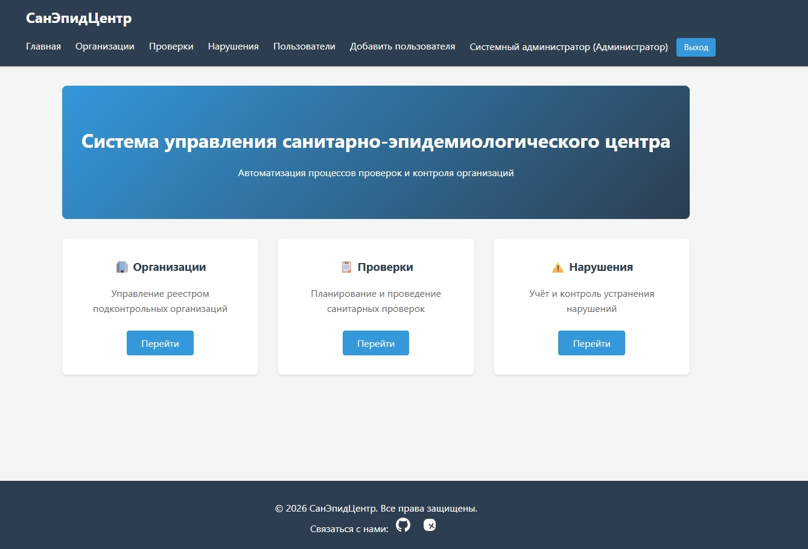
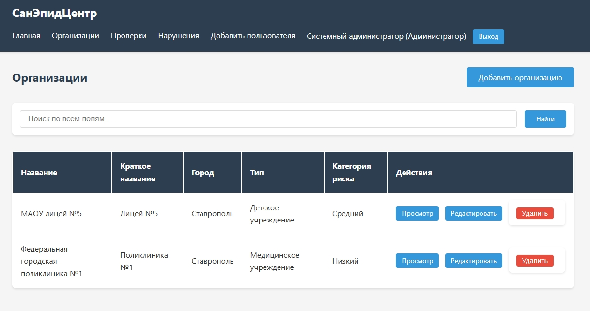
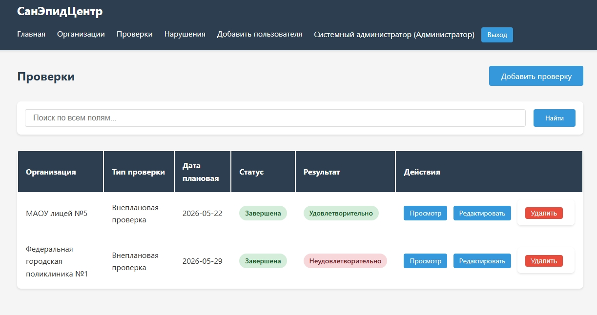
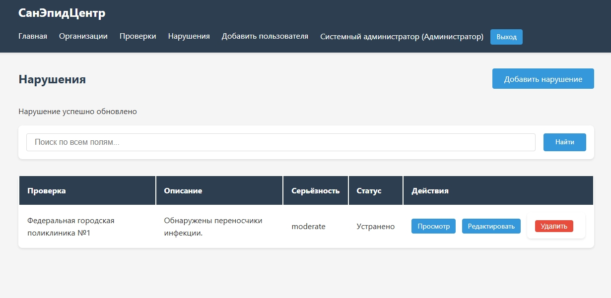
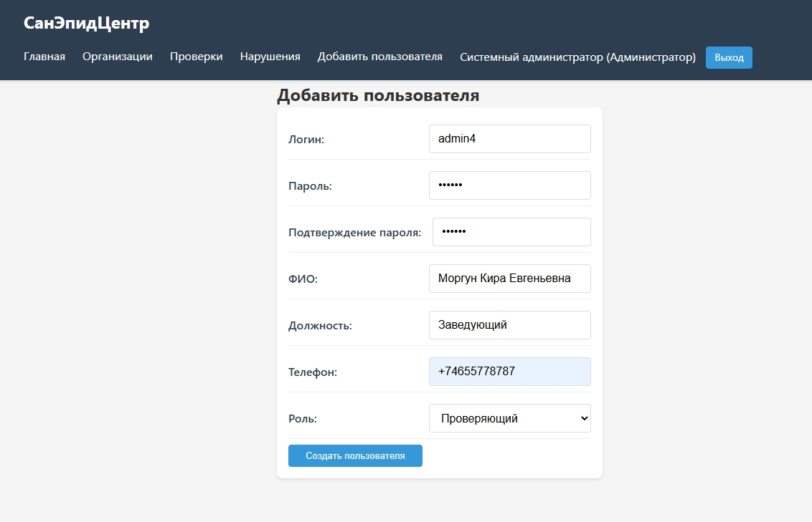

# UI-экраны приложения

**Проект:** Информационная система Центра гигиены и эпидемиологии
**Фреймворк:** Thymeleaf + Bootstrap 5  
**Дата:** 01.06.2026

---

## 1. Главная страница (Dashboard)

**Описание:** Центральная навигационная панель системы с быстрым доступом к основным модулям. Содержит три карточки для перехода к управлению организациями, проверками и нарушениями.

**Функциональность:**
- Быстрый доступ к основным разделам системы
- Отображение названия системы и описания
- Навигационное меню в шапке
- Ссылки для связи (GitHub, VK)
 

---

## 2. Страница управления организациями

**Описание:** Реестр всех поднадзорных организаций с возможностью поиска, просмотра, редактирования и удаления записей.

**Функциональность:**
- Таблица с колонками: Название, Краткое название, Город, Тип, Категория риска, Действия
- Поиск по всем полям
- Кнопки действий: Просмотр, Редактировать, Удалить
- Кнопка «Добавить организацию» для создания новой записи
- Отображение категорий риска (Низкий, Средний, Высокий)
 

---

## 3. Страница управления проверками

**Описание:** Журнал всех проведённых и планируемых санитарных проверок организаций.

**Функциональность:**
- Таблица с колонками: Организация, Тип проверки, Дата плановая, Статус, Результат, Действия
- Фильтрация и поиск по проверкам
- Цветовая индикация статусов (зелёный — завершена, красный — неудовлетворительно)
- Кнопки действий: Просмотр, Редактировать, Удалить
- Кнопка «Добавить проверку» для планирования новой проверки
 

---

## 4. Страница управления нарушениями

**Описание:** Реестр выявленных нарушений санитарных норм с контролем статуса устранения.

**Функциональность:**
- Таблица с колонками: Проверка, Описание, Серьёзность, Статус, Действия
- Отображение серьёзности нарушений (minor, moderate, major, critical)
- Статус устранения (Устранено / Не устранено)
- Поиск по всем полям
- Кнопки действий: Просмотр, Редактировать, Удалить
- Сообщение об успешном обновлении нарушения
- Кнопка «Добавить нарушение»
 

---

## 5. Страница добавления пользователя

**Описание:** Форма регистрации нового пользователя системы с назначением роли и должностных обязанностей.

**Функциональность:**
- Поля формы:
  - Логин (уникальный идентификатор для входа)
  - Пароль (с маскированием)
  - Подтверждение пароля
  - ФИО (полное имя пользователя)
  - Должность
  - Телефон (с маской ввода)
  - Роль (выпадающий список: Проверяющий, Лаборант, Администратор)
- Валидация совпадения паролей
- Кнопка «Создать пользователя»
- Интеграция с системой ролевой безопасности

---
